```{r setup, include=FALSE}
knitr::opts_chunk$set(echo = TRUE,
                      warning = F,
                      message = F)
options(width = 180)
unlink('reports/markdown_report_cache', recursive = TRUE)
```
# Data preparation

## Load packages
* **Load packages**: All necessary packages are loaded in from the `libraries.r` script in the `/scripts` folder.
* **Author dictionary**: An author dictionary is created to manage the presentation of author names in the final tables and meta-analyses
* **Load scripts**: We have written functions to handle much of the Bayesian analysis
* **Load Bayesian datasets**: The Bayesian approach relies on large simulated datasets from the observed data, for this report we only present the results graphically from data simulated outside of the report. The scripts `bayes_scripts.R`, `bayesian_data_generation.R` and `bayesian_analysis.R` should be able to be run locally to generate your own simulated data.

The code is all stored in the GitHub repository [here](https://github.com/DidDrog11/smoking_covid/tree/master)
```{r load_packages, include=FALSE, quietly=T}
source(here::here("scripts", "libraries.R"))
```

```{r load_dictionary}
source(here("scripts", "author_dictionary.R"))
```
## Download data
This is relatively automated in this script however, if you don't have an API key you can download the file individually and store it in the `/data_spreadsheet` folder as `data_extraction_current.xlsx`, the sheets are then extracted from the file.
``` {r google_data}
google_api <- rstudioapi::askForSecret("Google API Key")
register_google(google_api)
drive_download("https://docs.google.com/spreadsheets/d/1jelIGxrm99QpDKwSoyMUliDJQWtzk4bHsNGDaIjxTaU/edit?usp=sharing", path = here("data_spreadsheet", "data_extraction_current.xlsx"), overwrite = T)

search_details <- readxl::read_xlsx(here("data_spreadsheet", "data_extraction_current.xlsx"), sheet = 'article_screening')
data_study_general <- readxl::read_xlsx(here("data_spreadsheet", "data_extraction_current.xlsx"), sheet = 'general_details')
table_1 <- readxl::read_xlsx(here("data_spreadsheet", "data_extraction_current.xlsx"), sheet = 'pop_descriptives')
table_2 <- readxl::read_xlsx(here("data_spreadsheet", "data_extraction_current.xlsx"), sheet = 'testing')
table_3 <- readxl::read_xlsx(here("data_spreadsheet", "data_extraction_current.xlsx"), sheet = 'hospitalisation')
table_4 <- readxl::read_xlsx(here("data_spreadsheet", "data_extraction_current.xlsx"), sheet = 'severity')
table_5 <- readxl::read_xlsx(here("data_spreadsheet", "data_extraction_current.xlsx"), sheet = 'mortality')
table_6 <- readxl::read_xlsx(here("data_spreadsheet", "data_extraction_current.xlsx"), sheet = 'updated_quality_appraisal')
```
We maintain a Google sheets document [here](sheets_id) which contains all eligible articles the research team have identified. This is currently viewable only and not open for editing. We have collected the general information for the search in the first sheet, the studies general information in the second, further information on study populations, outcomes of interest and quality of the studies are contained in the further sheets. These sheets are organised in a similar way to the manuscript and so are labelled table_1 to table_6.

We have extracted data from `r nrow(data_study_general)` studies, however, some of these are duplicates and some have been removed from the analysis set. For example there have been multiple versions of the ISARIC report and several publications have been retracted. We aim to keep on top of this but there is some risk that in between versions data may be superseded.

## Raw Data
The first sheet is **Search details**  we use this sheet to keep track of the number of studies found in our search and keep track of the number of titles and abstracts screened and number of papers included in each review version. It presents the data in groups of search periods.

```{r head_search_details}
flextable(search_details[,1:13])
```
The second sheet is **General study details** this includes the lead author, where the study is published, the date it was published, the country in which the data originated and the DoI or link to the publication for our records.

This is a searchable list of all the studies that have met out inclusion and exclusion criteria up until `r paste(max(search_details$date_screened))`. These are live links and should direct to the relevant article, however, some may have been deleted or require institutional access.
```{r tail_study_details, include=FALSE}
datatable(data_study_general[1:4] %>%
            mutate(`date_published_format(2020-05-12)` = as.Date(data_study_general$`date_published_format(2020-05-12)`),
                   doi = paste0("<a href='",doi,"' target='_blank'>",doi,"</a>")),
          colnames = c("Lead author" = 2, "Date published" = 3, "Source" = 4, "DOI" = 5),
          escape = F)
```
The third sheet produces **Table 1** this contains the details of the population of the studies in our review. Primarily includes smoking status but also the proportion of females in the study and the age of participants.
```{r tail_table_1, include=FALSE}
datatable(table_1 %>%
                 filter(lead_author != is.na(lead_author)))
```
The fourth sheet produces **Table 2** this contains the data extracted from relevant studies on testing data and smoking status. Most studies will not have data on this outcome however we filter these subsequently. These are sparse datasets as many studies do not report on all levels of smoking exposure.
```{r tail_table_2, include=FALSE}
datatable(
  table_2 %>%
  filter(data_on_testing == TRUE)
)
```
The fifth sheet produces **Table 3** this contains the data extracted from relevant studies on hospitalisation and smoking status. 
```{r tail_table_3, include=FALSE}
datatable(
  table_3 %>%
  filter(data_on_hospitalisation == TRUE)
)
```
The sixth sheet produces **Table 4** this contains the data extracted from relevant studies disease severity data and smoking status. Disease severity is differentially reported across the studies in some there is reference to WHO severity score in others we have based the distinction on clinical characteristics or whether patients were admitted to Intensive or Critical care areas.
```{r tail_table_4, include=FALSE}
datatable(
  table_4 %>%
  filter(data_disease_severity == TRUE)
)
```
The seventh sheet produces **Table 5** this contains the data extracted from relevant studies on COVID-19 related mortality and smoking status. A caution needed when interpreting this data is that most studies have not followed patients up for sufficient amounts of time to be able to accurately report on disease associated mortality.
```{r tail_table_5, include=FALSE}
datatable(
  table_5 %>%
  filter(data_on_deaths == TRUE)
)
```
The final sheet is used to collate data on **Study quality**. The method of assessing quality changed in version 3 of the review. We now use the following criteria:

- **Good:** 
  1. <20% missing data on smoking status and used a reliable self-report measure that distinguished between current, former and never smoking status AND
  2. biochemical verification of smoking status and reported results from adjusted analyses OR 
  3. reported data from a representative/random sample
- **Fair**
  1. <20% missing data on smoking status and used a reliable self-report measure that distinguished between current, former and never smoking status
- **Poor**
  1. The remainder of the studies

## Clean data and save updated versions as RDS files
The data from the google sheets document is then cleaned using a script from the `linelist` package which has been developed by T. Jombart and Z. Kamvar within the [R Epidemics Consortium](https://www.repidemicsconsortium.org/)
The function `clean_data()` ensures consistency among column names, country names, dates and missing values in the included sheets. Data is also saved as `.rds` files in the `/data_clean` folder of the project repository. 
```{r clean_data}
source(here("scripts", "clean_data.r"))
```
The package `flextable` can save tables in a format that is easily manageable within word which we currently use to write the manuscript (until I get better with RMarkdown). At various points I save these to the `output_data` folder.
``` {r save_as_table_for_word, include=FALSE}
datatable(a)

a <- flextable(a)%>%
  set_caption(a, caption = 'All studies included in data extraction') %>%
  set_table_properties(width = 1, layout = 'autofit')

save_as_docx(a, path = here('output_data', 'all_studies.docx'))
```

# Preparing the descriptive analysis

## Choosing which data we want to include in the current review?
``` {r versioning}
date_of_update <- Sys.Date()

prev_versions <- head(unique(data_study_general$review_version), n = -1)
#This can categorise which studies we want to look at
current_version <- tail(unique(data_study_general$review_version), n = 1)
#This will categorise which studies we are including in the current report

analysed_versions <- c(prev_versions, current_version)
#This will incorporate all studies into the current version of the report

versioning <- cbind(prev_versions, current_version, analysed_versions)
write_rds(versioning, here("data_clean", "versioning.rds"))
```
We define the current version of the report here. This report has been generated for version `r paste(current_version)`

``` {r excluding_studies}
superseded_studies <- names(tidyselect::vars_select(data_study_general$lead_author, ends_with("_old", ignore.case = T)))
old_isaric <- head(names(tidyselect::vars_select(data_study_general$lead_author, starts_with("isaric", ignore.case = T))), n = -1)
excluded_other_reason <- c("mehra", #retracted
                           "hopkinson", #self-reported
                           "gaibazzi", #withdrawn
                           "kua" #self-reported
                           )

exclude_from_analysis <- unique(c(superseded_studies, old_isaric, excluded_other_reason))
write_rds(exclude_from_analysis, here("output_data", "excluded_studies.rds"))
```
We don't want to remove studies from the dataset despite them no longer being included in the analysis. The excluded studies are defined in this chunk of code. We have excluded this version the following studies:

`r knitr::combine_words(exclude_from_analysis)`

Generally we label these as _old in the Google sheet but there are exceptions to this so we manually define them.

## Filter the included studies
Based on the version and excluded studies we produce the tables for analysis. 

This is a searchable table.
``` {r descriptives}
source(here("scripts", "remove_excluded.r"))
datatable(a)

a <- flextable(a)%>%
  set_table_properties(width = 1, layout = 'autofit') %>%
  set_caption(caption = 'Studies included in the current analysis')

save_as_docx(a, path = here('output_data', 'included_studies.docx'))
```  

# Study descriptive analysis

## The PRISMA diagram will be updated
The PRISMA reporting guidelines for systematic reviews the guidance is available [here](http://www.prisma-statement.org/). This takes the format of the number of articles obtained from the search from [OVID](https://ovidsp.dc1.ovid.com/sp-4.07.0b/ovidweb.cgi) (login may be needed), [medRxiv](https://www.medrxiv.org/search/text_abstract_title%3Asmoking%2BAND%2BCOVID%20text_abstract_title_flags%3Amatch-all%20jcode%3Amedrxiv%20numresults%3A75%20sort%3Apublication-date%20direction%3Adescending%20format_result%3Astandard), and articles identified by the research team. These are then screened at the title and abstract level. Full texts are then read to extract relevant data, if articles are excluded at this level we describe the reason for this. All of the selected articles will contribute to the narrative synthesis but only those that are judged 'good' or 'fair' quality will be included in the Bayesian meta-analysis.
``` {r PRISMA}
current_total <- 345

previous_total <- 279

prisma <- search_details %>%
  group_by(review_version) %>%
  filter(review_version == current_version) %>%
  mutate(title_abstract = sum(ovid_titles, medrxiv_titles, other_source_included),
         full_texts_assessed = sum(ovid_abstract_full, medrxiv_abstract_full, other_source_included),
         title_abstract_included = sum(ovid_included, medrxiv_included, other_source_included),
         title_abstract_excluded = title_abstract - full_texts_assessed,
         full_text_excluded = full_texts_assessed-total_included,
         full_text_included = full_texts_assessed-full_text_excluded,
         previous_total = previous_total,
         previous_minus_superseded = previous_total-superseded,
         current_total = current_total) %>%
  select("Review version" = review_version,
         "Date Screened" = date_screened,
         "OVID results" = "ovid_titles",
         "medRxiv results" = "medrxiv_titles",
         "Other sources" = "other_source_included",
         "Titles/abstracts screened" = "title_abstract",
         "Titles/abstracts excluded" = "title_abstract_excluded",
         "Full texts screened" = "full_texts_assessed",
         "Full texts excluded" = "full_text_excluded",
         "Records included" = "full_text_included",
         "Records carried forward" = "previous_minus_superseded",
         "Supersed from previous version" = superseded,
         "Studies in narrative synthesis" = "current_total")
flextable(prisma)
```
The number of studies contributing to meta-analysis is calculated later.

## We summarise where the studies were conducted

As the pandemic continues studies are being reported from an increasing numbers of countries. 

``` {r countries, cache = TRUE}
#Countries
country <- table_1$country %>%
  to_upper_camel_case() %>%
  recode(., 'Usa' = 'USA', 'Uk' = 'UK', 'SaudiArabia' = 'Saudi Arabia', "SouthKorea" = "South Korea", "UnitedArabEmirates" = "United Arab Emirates") %>%
  table() %>%
  as.data.frame() %>%
  arrange(desc(Freq)) %>%
  rename('Country' = 1,
         'Number' = 2) %>%
  mutate(Country = as.character(Country))

all_countries <- country %>%
  group_split(-Number)

ggplot(country, aes(x = reorder(Country, desc(-Number)), y = Number))+
  geom_col()+
  coord_flip()+
  theme_bw()+
  labs(title = 'Countries where studies were performed',
       y = 'Number of studies',
       x = 'Country')

a <- flextable(country) %>%
  set_table_properties(width = 0.5, layout = 'autofit')
a

country <- subset(country, Country != "Multiple")
```
Currently studies are reported from `r paste(nrow(country))`
``` {r}
country <- mutate_geocode(country, Country)

country_bounds <- country %>%
  select(lon, lat) %>%
  tidyr::drop_na() %>%
  sp::SpatialPointsDataFrame(coords = .[,1:2], data = .) %>%
  sp::bbox() * 1.1

map_world <- map_data(map = "world") %>%
  filter(region != "Antarctica")

save_as_docx(a, path = here('output_data', 'Countries_performing_studies.docx'))  
```
## A map is produced for where the studies are performed
``` {r interactive global map, cache = TRUE}
library(rgdal)
library(leaflet)
library(coronavirus)

my_spdf <- readOGR( 
  dsn= paste0(here::here("data_clean", "world_shape_file")), 
  layer="TM_WORLD_BORDERS_SIMPL-0.3",
  verbose=FALSE
)

from_countries <- c("USA", "UK", "Iran",  "Korea, South")
to_countries <- c("United States", "United Kingdom", "Iran (Islamic Republic of)", "Korea, Republic of")
country_map <- country %>%
  mutate(Country = plyr::mapvalues(Country, from = from_countries,
                to = to_countries))

refresh_coronavirus_jhu()
data("coronavirus")
summary_df <- coronavirus %>% 
  filter(type == "confirmed") %>%
  group_by(country) %>%
  summarise(total_cases = sum(cases)) %>%
  arrange(-total_cases) %>%
  rename("NAME" = country) %>%
  mutate(NAME = plyr::mapvalues(NAME, from = from_countries,
                to = to_countries))

my_spdf@data <- left_join(my_spdf@data, country_map %>%
            rename(NAME = Country),
          by = "NAME") %>%
  left_join(., summary_df %>%
              mutate(total_cases = total_cases/1000),
            by = "NAME") %>%
  mutate(NAME = as.factor(NAME))

my_spdf@data$Number[ which(my_spdf@data$Number == 0)] = NA
my_spdf@data$total_cases[ which(is.na(my_spdf@data$total_cases))] = 0


my_bins <- c(0, 1, 5, 10, 20, 50, 70, 100)
mypalette <- colorBin(palette="YlOrBr", domain=my_spdf@data$Number, na.color="transparent", bins=my_bins)

mytext <- paste(
  "Country: ", my_spdf@data$NAME,"<br/>", 
  "Number of studies included: ", my_spdf@data$Number, "<br/>", 
  "COVID-19 reported cases (thousands): ", round(my_spdf@data$total_cases, 2), 
  sep="") %>%
  lapply(htmltools::HTML)

html_map <- leaflet(my_spdf) %>% 
  addTiles()  %>% 
  setView(lat=10, lng=0 , zoom=2) %>%
  addPolygons( 
    fillColor = ~mypalette(Number), 
    stroke=TRUE, 
    fillOpacity = 0.9, 
    color="white", 
    weight=0.3,
    label = mytext,
    labelOptions = labelOptions( 
      style = list("font-weight" = "normal", padding = "3px 8px"), 
      textsize = "13px", 
      direction = "auto"
    )
  ) %>%
  addLegend( pal=mypalette, values=~Number, opacity=0.9, title = "Number of studies included", position = "bottomright" )

html_map
```
This map displays the number of studies produced in each country. The number of confirmed COVID-19 cases are shown when resting over each country for reference, data on confirmed cases have been obtained from [Rami Krispin's `coronavirus` package](https://ramikrispin.github.io/coronavirus/). The number of cases is updated when the report is generated so will not remain in date, it is current as of `r paste(Sys.time())`. Countries displaying 0 cases are most likely due to naming mismatches.

## We sumarise the settings in which they were conducted

Most studies are performed in hospital settings. Some studies are conducted in both such as those in emergency departments where patients are discharged home and followed up. Some registry studies utilising primary care networks are solely conducted in the community.
``` {r setting}
#Setting
setting <- to_upper_camel_case(data_study_general$study_setting, sep_out = ' ') %>%
  table(.) %>%
  sort('Number of studies', decreasing = T) %>%
  as.data.frame() %>%
  arrange(desc(Freq)) %>%
  rename('Setting' = 1,
         'Number' = 2)

a <- flextable(setting) %>%
  set_table_properties(width = 0.5, layout = 'autofit')
a

save_as_docx(a, path = here('output_data', 'Countries_performing_studies.docx'))  
```
## We summarise the design of the included studies

The majority were retrospective cohorts. There were fewer case-control and cross-sectional studies. There were some prospective cohorts established and reported.
``` {r design}
design <- to_upper_camel_case(data_study_general$study_design, sep_out = ' ') %>%
  recode("Rct" = "RCT") %>%
  table(.) %>%
  sort('Number of studies', decreasing = T) %>%
  as.data.frame() %>%
  arrange(desc(Freq)) %>%
  rename('Design' = 1,
         'Number' = 2)

a <- flextable(design) %>%
  set_table_properties(width = 0.5, layout = 'autofit')
a

save_as_docx(a, path = here('output_data', 'Study_designs.docx'))  

##For supplementary tables
study_design <- data_study_general %>%
  select(lead_author, study_design) %>%
  mutate(study_design = to_upper_camel_case(study_design, sep_out = " "),
         study_design = ifelse(study_design == "Rct", "Randomised Controlled Trial", study_design))
```
## We update the number of participants we have included

* **Summary statistics:** this table will give us the mean, median and IQR of the samples in the review 
``` {r numbers}
#Numbers
participants <- summary(as.numeric(table_1$sample_size))
```
* **Total number of participants**: `r paste(sum(as.numeric(table_1$sample_size)))`

## We want to know if they use a CRF or electronic health record
The majority of data on smoking outcomes is extracted from electronic health records that are routinely collected in the provision of healthcare. Some of the studies utilise specifically designed Case Report Forms (CRFs). The source of information on smoking status is not always reported.
``` {r data_source}
#Source of data
data_source <- table_1$data_source %>%
  recode('electronic_health_records' = 'Electronic health record',
         'case_report_form' = 'Case report form',
         'not_stated' = 'Not stated') %>%
  table() %>%
  as.data.frame() %>%
  arrange(desc(Freq)) %>%
  rename('Data source' = 1,
         'Number' = 2) 

data_source %>%
  flextable() %>%
  set_table_properties(width = 0.5, layout = 'autofit')
```

## Classification of COVID
``` {r diagnosis_method}
diagnostics <- table(data_study_general$diagnostic_approach)
diagnostics
```

# Smoking descriptive data {.tabset .tabset-fade .tabset-pills}
``` {r smokers}
#Studies reporting smokers
current_smok <- table_1 %>%
  filter(., current_smoker != 'NA')
```
* **Current smokers:** `r paste(nrow(current_smok))` studies report on the numbers of current smokers
``` {r former smokers}
#Studies reporting former smokers
former_smok <- table_1 %>%
  filter(., former_smoker != 'NA')
```
* **Former smokers:** `r paste(nrow(former_smok))` studies report on the numbers of former smokers
```{r never smokers}
#Studies reporting never smokers
never_smok <- table_1 %>%
  filter(., never_smoker != 'NA')
```
* **Never smokers:** `r paste(nrow(never_smok))` studies report on the numbers of never smokers
``` {r current former smokers}
#Studies reporting current/former smokers
current_former_smok <- table_1 %>%
  filter(., current_former_smoker != 'NA')
```
* **Current/former smokers:** `r paste(nrow(current_former_smok))` studies report on the numbers of current/former smokers without distinguishing between them, often termed as yes to a smoking history question.
``` {r missing/never/unknown/not stated}
#Studies reporting missing data
missing_smok <- table_1 %>%
  filter(., missing != 'NA') %>%
  mutate(percent = missing/total*100)
minimum <- min(missing_smok$percent)
maximum <- max(missing_smok$percent)
#Studies reporting never/unknown
never_smok_unknown <- table_1 %>%
  filter(., never_smoker_unknown != 'NA')

#Studies with not stated
smok_not_stated <- table_1 %>%
  filter(., not_stated != 'NA')
```
* **Missing, never/unknown and not stated:** studies report on the numbers of missing (`r paste(nrow(missing_smok))`, `r paste(round((nrow(missing_smok)/nrow(data_study_general)*100),2), "%", sep = "")`), never/unknown (`r paste(nrow(never_smok_unknown))`) or not stated (`r paste(nrow(smok_not_stated))`) smoking history. This is often framed as absence of a smoking history.
  + **Minimum missing:** `r paste(round(minimum,2), "%", sep = "")`  
  + **Maximum missing:** `r paste(round(maximum,2), "%", sep = "")`

## Studies reporting current, former and never smoking status
``` {r complete}
#Studies reporting current, former and never smoking status
full_smoking_status <- table_1 %>%
  filter(lead_author %in% current_smok$lead_author) %>%
  filter(lead_author %in% former_smok$lead_author) %>%
  filter(lead_author %in% never_smok$lead_author)

b <- full_smoking_status %>%
  select(lead_author, sample_size, current_smoker, former_smoker, never_smoker, study_id) %>%
  rename('Lead author' = lead_author,
         'Sample size' = sample_size,
         'Current smokers' = current_smoker,
         'Former smokers' = former_smoker,
         'Never smokers' = never_smoker,
         'Study ID' = study_id)

b$`Lead author` <- to_upper_camel_case(b$`Lead author`, sep_out = ", ")
b$`Lead author` <- plyr::mapvalues(b$`Lead author`,
                               from = cleaned_names,
                               to = correct_names)  
datatable(b,
          caption = "Studies providing data on current, former and never smokers") %>%
  formatRound(columns = c(2:5), digits = 0, interval = 3, mark = ",")
#These are the studies with data on current, former and never smokers
set_flextable_defaults(digits = 0, big.mark = ",", na_str = "-")

b <- b %>%
  select(-"Study ID") %>%
  flextable() %>%
    set_caption(caption = 'Studies reporting complete smoking status') %>%
  colformat_double(j = c("Sample size", "Current smokers", "Former smokers", "Never smokers"),
                digits = get_flextable_defaults()$digits, big.mark = get_flextable_defaults()$big.mark, na_str = get_flextable_defaults()$na_str) %>%
  set_table_properties(width = 1, layout = 'autofit')

save_as_docx(b, path = here('output_data', 'Supplementary_1a.docx'))
```
* **Studies with complete smoking status:** `r paste(nrow(full_smoking_status))`, `r paste(round((nrow(full_smoking_status)/nrow(data_study_general)*100),2), "%", sep = "")`

## Studies providing partially complete data on smoking status

``` {r incomplete}
#Studies reporting current or current/former and never smoking
semi_full_smoking_status <- table_1 %>%
  filter(lead_author %in% current_former_smok$lead_author) %>%
  filter(lead_author %in% never_smok$lead_author) %>%
  filter(!lead_author %in% full_smoking_status$lead_author)

b <- semi_full_smoking_status %>%
  select(lead_author, sample_size, current_former_smoker, never_smoker, study_id) %>%
  rename('Lead author' = lead_author,
         'Sample size' = sample_size,
         'Current/former smokers' = current_former_smoker,
         'Never smokers' = never_smoker,
         'Study ID' = study_id)

b$`Lead author` <- to_upper_camel_case(b$`Lead author`, sep_out = ", ")
b$`Lead author` <- plyr::mapvalues(b$`Lead author`,
                               from = cleaned_names,
                               to = correct_names)  

datatable(b,
          caption = "Studies providing partially complete data on smoking status") %>%
  formatRound(columns = c(2:4), digits = 0, interval = 3, mark = ",")

b <- b %>%
  select(-"Study ID") %>%
  flextable() %>%
    set_caption(caption = 'Studies reporting complete smoking status') %>%
  colformat_double(j = c("Sample size", "Current/former smokers", "Never smokers"),
                digits = get_flextable_defaults()$digits, big.mark = get_flextable_defaults()$big.mark, na_str = get_flextable_defaults()$na_str) %>%
  set_table_properties(width = 1, layout = 'autofit')

save_as_docx(b, path = here('output_data', 'Supplementary_1b.docx'))
```

* **Studies reporting partially incomplete smoking data:** `r paste(nrow(semi_full_smoking_status))`  
These studies typically report smoking history as the measure of exposure which is why they have grouped values for current/former smokers

## Studies providing incomplete data on smoking status
``` {r}
#Remaining studies
incomplete_smoking_status <- table_1 %>%
  filter(!lead_author %in% full_smoking_status$lead_author) %>%
  filter(!lead_author %in% semi_full_smoking_status$lead_author)

b <- incomplete_smoking_status %>%
  select(lead_author, sample_size, current_smoker, current_former_smoker, former_smoker, never_smoker, never_smoker_unknown, not_stated, missing, study_id) %>%
  rename('Lead author' = lead_author,
         'Sample size' = sample_size,
         'Current smokers' = current_smoker,
         'Current/former smokers' = current_former_smoker,
         'Former smoker' = former_smoker,
         'Never smokers' = never_smoker,
         'Never smoker/unknown' = never_smoker_unknown,
         'Not stated' = not_stated,
         'Missing' = missing,
         'Study ID' = study_id)

b$`Lead author` <- to_upper_camel_case(b$`Lead author`, sep_out = ", ")
b$`Lead author` <- plyr::mapvalues(b$`Lead author`,
                               from = cleaned_names,
                               to = correct_names)  

datatable(b,
          caption = "Studies providing incomplete data on smoking status") %>%
  formatRound(columns = c(2:8), digits = 0, interval = 3, mark = ",")

numeric_names <- colnames(b[2:9])
b <- b %>%
  select(-"Study ID") %>%
  flextable() %>%
    set_caption(caption = 'Studies reporting complete smoking status') %>%
  colformat_double(j = numeric_names,
                digits = 0, na_str = '-', big.mark = ',') %>%
  set_table_properties(width = 1, layout = 'autofit')

save_as_docx(b, path = here('output_data', 'Supplementary_1c.docx'))
```

* **Studies missing key smoking data:** `r paste(nrow(incomplete_smoking_status))`  

# Smoking prevalence by country {.tabset .tabset-fade .tabset-pills}
``` {r smoking_country, quietly=T}

#Smoking prevalence by country
country_prevalence_list <- table_1 %>%
    group_by(country, .add = T) %>%
  mutate(., current_smok_percentage = current_smoker/total*100) %>%
  mutate(., former_smok_percentage = former_smoker/total*100) %>%
  mutate(., missing_percentage = missing/total*100) %>%
  mutate(., not_stated_percentage = not_stated/total*100) %>%
  mutate(never_smoker_percentage = never_smoker/total*100) %>%
  group_split()

source(here("scripts", "smoking_plots.R"))
```
We have split the data into a list where each country can be analysed separately if required.

Prevalence graphs are produced in the `smoking_plots.R` script. This uses data extracted on current and former smoking prevalence data from countries which have included studies in this review. We calculate the mean weighted prevalence.

## Graph for smoking prevalence
**Current smoking prevalence**
The studies are grouped by the country in which they were conducted. The dashed line represents national current smoking prevalence obtained from national smoking survey estimates. The size of the shape corresponds to the relative size of the study sample. The weighted mean current smoking prevalence is displayed for each setting.


## Graph for former smoking prevalence
**Former smoker prevalence**
This graph is for former smoking prevalence. The data is more sparse for this exposure and therefore several countries are missing for the analysis. Studies are further grouped by the setting in which they were conducted, Hospital (Triangle), Community (Square) and Community and Hospital (Circle). The size of the shape corresponds to the relative size of the study sample. The weighted mean current smoking prevalence is displayed for each setting.
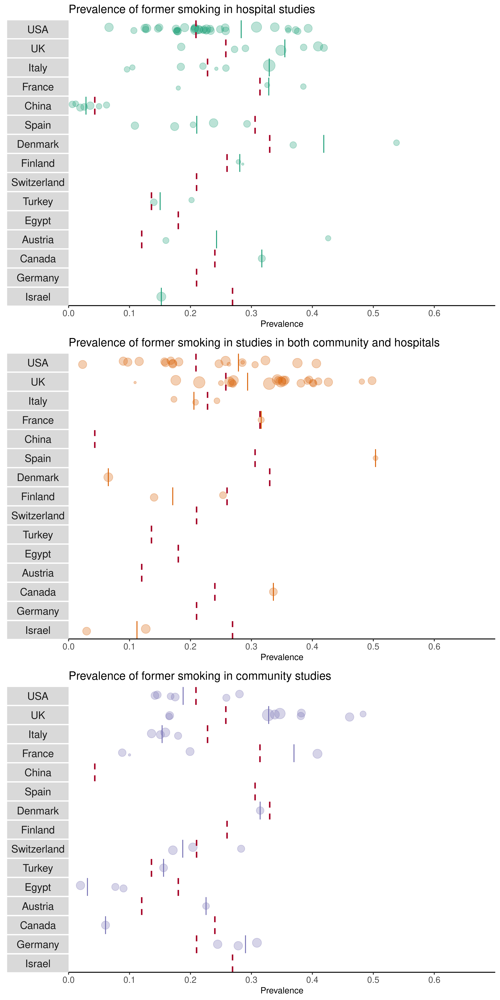

# Final results tables and meta-analyses {.tabset .tabset-fade .tabset-pills}

## Table 1: Included studies
``` {r table_1}
#Updating table 1
table_1_word <- table_1 %>%
  mutate(., current_percentage = current_smoker/total*100,
         former_percentage = former_smoker/total*100,
         current_former_percentage = current_former_smoker/total*100,
         never_smoker_percentage = never_smoker/total*100,
         never_smoker_unknown_percentage = never_smoker_unknown/total*100,
         not_stated_percentage = not_stated/total*100,
         missing_percentage = missing/total*100) %>%
  select(lead_author, date_published, country, sample_size, median_age, iqr_lower, iqr_upper, mean_age, lower_range,
         upper_range, standard_deviation, female_sex_percent, current_percentage, former_percentage, current_former_percentage,
         never_smoker_percentage, never_smoker_unknown_percentage, not_stated_percentage, missing_percentage, study_id) %>%
  replace_na(., list(not_stated_percentage = 0, missing_percentage = 0)) %>%
  mutate(., missing_percentage = not_stated_percentage + missing_percentage,
         missing_percentage = formatC(missing_percentage, digits = 2, format = "f"))

#Smoking completeness
smoking_status <- as_tibble(full_smoking_status$lead_author) %>%
  rename(lead_author = 1) %>%
  mutate(complete_status = c("Yes")) %>%
  bind_rows(., semi_full_smoking_status %>%
              select(lead_author)) %>%
  bind_rows(., incomplete_smoking_status %>%
              select(lead_author)) %>%
  distinct() %>%
  mutate(complete_status = replace_na(complete_status, "No"))

#Data missingness
missingness <- table_6 %>%
  select(lead_author) %>%
  left_join(., table_1_word %>%
              select(lead_author, missing_percentage)) %>%
  mutate(missing_percentage = as.numeric(missing_percentage),
         low_missingness = ifelse(missing_percentage >= 20, "No", "Yes"))

#Defining poor quality
poor_quality <- missingness %>%
  select(-missing_percentage) %>%
  left_join(., smoking_status, by = "lead_author") %>%
  mutate(study_quality = ifelse(low_missingness == "No" | complete_status == "No", "Poor", "Not_poor"))

good_quality <- table_6 %>%
  left_join(., poor_quality, by = "lead_author") %>%
  select(lead_author, study_quality, biochemical_verification, random_representative_sample) %>%
  mutate(study_quality_final = ifelse(study_quality == "Not_poor" & (biochemical_verification == "Yes" | random_representative_sample == "Yes"), "good",
                                      ifelse(study_quality == "Poor", "poor", "fair")))

quality_rating <- good_quality %>%
  select(lead_author, study_quality_final) %>%
  rename("overall_quality" = study_quality_final)

fair_quality_number <- quality_rating %>%
  filter(overall_quality == "fair")

poor_quality_number <- quality_rating %>%
  filter(overall_quality == "poor")

table_1_word <- left_join(table_1_word, good_quality %>%
                            select(lead_author, study_quality_final))

a <- data_study_general %>%
  select(study_id, study_setting)

table_1_word <- left_join(table_1_word, a, by = 'study_id') %>%
  select(1:4, 22, 5:19, 21, 20)
table_1_word$date_published <- as.Date.character(table_1_word$date_published)
write_rds(table_1_word, here::here('data_clean', 'table_1_word.rds'))

table_1_word <- table_1_word %>%
  mutate(median_mean = ifelse(is.na(median_age), mean_age, median_age))

a <- table_1_word %>%
  mutate(median_mean = ifelse(is.na(median_age), mean_age, median_age),
         mean_used = ifelse(is.na(mean_age), '','^'),
         iqr = ifelse(is.na(iqr_lower), NA, paste(iqr_lower, iqr_upper, sep = '-')),
         range_combined = paste(lower_range, upper_range, sep = '-'),
         range_combined = na_if(range_combined, 'NA-NA'),
         standard_deviation = as.numeric(standard_deviation),
         st_dev = paste((as.integer(median_mean-standard_deviation)), as.integer((median_mean+standard_deviation)), sep = '-'),
         st_dev = na_if(st_dev, 'NA-NA'))

a$iqr <- coalesce(a$iqr, a$range_combined, a$st_dev)

a <- a %>%
  select(study_id, lead_author, date_published, country, sample_size, study_setting, median_mean, mean_used, iqr,
         female_sex_percent, current_percentage, former_percentage, current_former_percentage, never_smoker_percentage,
         never_smoker_unknown_percentage, missing_percentage, study_quality_final) %>%
  mutate(median_mean = paste(median_mean, mean_used, sep = ''),
         median_mean = na_if(median_mean, NA)) %>%
  select(-mean_used) %>%
  mutate(median_mean = ifelse(median_mean == 'NA', 'NA', paste(paste(median_mean, iqr, sep = ' ('),')', sep = ''))) %>%
  select(-iqr) %>%
  rename('Study ID' = study_id,
         'Lead author' = lead_author,
         'Date published' = date_published,
         'Country' = country,
         'Sample size' = sample_size,
         'Study setting' = study_setting,
         'Median (IQR)' = median_mean,
         'Female %' = female_sex_percent,
         'Current smoker %' = current_percentage,
         'Former smokers %' = former_percentage,
         'Current/former smokers %' = current_former_percentage,
         'Never smokers %' = never_smoker_percentage,
         'Never/unknown smokers %' = never_smoker_unknown_percentage,
         'Missing %' = missing_percentage,
         "Study quality" = study_quality_final)

a$`Lead author` <- to_upper_camel_case(a$`Lead author`, sep_out = ", ")
author_list <- plyr::mapvalues(a$`Lead author`,
                               from = cleaned_names,
                               to = correct_names)

a$`Lead author` <- author_list

a$`Study setting` <-to_title_case(a$`Study setting`, sep_out = " ")
a$`Country` <-to_title_case(a$`Country`, sep_out = " ")
a$`Country` <- a$Country %>%
  recode('Usa' = 'USA',
         'Uk' = 'UK')

numeric_columns <- c('Median (IQR)', 'Female %', 'Current smoker %','Former smokers %', 'Current/former smokers %',
                     'Never smokers %', 'Never/unknown smokers %', 'Missing %')

saveRDS(a, file = here("data_clean", "table_1_refs.rds"))
source(here("scripts", "references_in_table.r"))
```
The total number of included studies is `r paste(nrow(table_1_word))`. This table is searchable
```{r}
datatable(a) %>%
  formatRound(
    columns = c(8:14),
    digits = 2,
    interval = 3,
    mark = ",",
    dec.mark = getOption("OutDec")
)

a <- flextable(a) %>%
    set_caption(caption = 'Characteristics of included studies') %>%
  colformat_double(j = numeric_columns, digits = 1, na_str = '-', big.mark = ',') %>%
  colformat_double(j = 'Sample size', digits = 0, na_str = '-', big.mark = ',') %>%
  set_table_properties(width = 1, layout = 'autofit')

saveRDS(a, file = here("reports", "tables", "table_1.rds"))
save_as_docx(a, path = here('output_data', 'Table_1.docx'))
```

## Table 2: Smoking and COVID-19 diagnostic testing
``` {r table_2}

#Table 2
table_2_word <-  table_2 %>%
  mutate(., sample = contributing_sample) %>%
  mutate(., negative_test_percentage =formatC(negative_test/sample*100, digits = 2, format = "f"),
         negative_current_percentage = formatC(negative_current_smoker/negative_test*100, digits = 2, format = "f"),
         negative_former_smoker_percentage = formatC(negative_former_smoker/negative_test*100, digits = 2, format = "f"),
         negative_current_former_smoker_percentage = formatC(negative_current_former_smoker/negative_test*100, digits = 2, format = "f"),
         negative_never_smoker_percentage = formatC(negative_never_smoker/negative_test*100, digits = 2, format = "f"),
         negative_not_stated_percentage = formatC(negative_not_stated/negative_test*100, digits = 2, format = "f"),
         positive_test_percentage = formatC(positive_test/sample*100, digits = 2, format = "f"),
         positive_current_smoker_percentage = formatC(positive_current_smoker/positive_test*100, digits = 2, format = "f"),
         positive_former_smoker_percentage = formatC(positive_former_smoker/positive_test*100, digits = 2, format = "f"),
         positive_current_former_smoker_percentage = formatC(positive_current_former_smoker/positive_test*100, digits = 2, format = "f"),
         positive_never_smoker_percentage = formatC(positive_never_smoker/positive_test*100, digits = 2, format = "f"),
         positive_not_stated_percentage = formatC(positive_not_stated/positive_test*100, digits = 2, format = "f")) %>%
  select(-data_on_testing, -missing, -date_published, -sample) %>%
  write_rds(here::here('data_clean', 'table_2_word.rds'))

quality_table_2 <- table_2_word %>%
  left_join(., quality_rating, by = 'lead_author')

a <- table_2_word %>%
  filter(contributing_sample >= 1) %>%
  mutate(Author = lead_author,
         Population_tested = contributing_sample,
         SARS_CoV_2_negative = paste(
           paste(negative_test, 
                 (negative_test_percentage), sep = " ("), "%)", sep = ""),
         N_current_smoker = paste(paste(negative_current_smoker, (negative_current_percentage), sep = " (")
                                  , "%)", sep = ""),
         N_current_smoker = na_if(N_current_smoker, "NA ( NA%)"),
         N_former_smoker = paste(paste(negative_former_smoker, (negative_former_smoker_percentage), sep = " (")
                                 , "%)", sep = ""),
         N_former_smoker = na_if(N_former_smoker, "NA ( NA%)"),
         N_current_former_smoker = paste(paste(negative_current_former_smoker,
                                               (negative_current_former_smoker_percentage), sep = " (")
                                         , "%)", sep = ""),
         N_current_former_smoker = na_if(N_current_former_smoker, "NA ( NA%)"),
         N_never_smoker = paste(paste(negative_never_smoker,
                                      (negative_never_smoker_percentage), sep = " (")
                                , "%)", sep = ""),
         N_never_smoker = na_if(N_never_smoker, "NA ( NA%)"),
         N_not_stated = paste(paste(negative_not_stated,
                                    (negative_not_stated_percentage), sep = " (")
                              , "%)", sep = ""),
         N_not_stated = na_if(N_not_stated, "NA ( NA%)")) %>%
  mutate(SARS_CoV_2_positive = paste(
    paste(positive_test, 
          (positive_test_percentage), sep = " ("), "%)", sep = ""),
    P_current_smoker = paste(paste(positive_current_smoker, (positive_current_smoker_percentage), sep = " (")
                             , "%)", sep = ""),
    P_current_smoker = na_if(P_current_smoker, "NA ( NA%)"),
    P_former_smoker = paste(paste(positive_former_smoker, (positive_former_smoker_percentage), sep = " (")
                            , "%)", sep = ""),
    P_former_smoker = na_if(P_former_smoker, "NA ( NA%)"),
    P_current_former_smoker = paste(paste(positive_current_former_smoker,
                                          (positive_current_former_smoker_percentage), sep = " (")
                                    , "%)", sep = ""),
    P_current_former_smoker = na_if(P_current_former_smoker, "NA ( NA%)"),
    P_never_smoker = paste(paste(positive_never_smoker,
                                 (positive_never_smoker_percentage), sep = " (")
                           , "%)", sep = ""),
    P_never_smoker = na_if(P_never_smoker, "NA ( NA%)"),
    P_not_stated = paste(paste(positive_not_stated,
                               (positive_not_stated_percentage), sep = " (")
                         , "%)", sep = ""),
    P_not_stated = na_if(P_not_stated, "NA ( NA%)")) %>%
  select(Author, Population_tested, SARS_CoV_2_negative, N_current_smoker, N_former_smoker, N_current_former_smoker,
         N_never_smoker, N_not_stated, SARS_CoV_2_positive, P_current_smoker, P_former_smoker, P_current_former_smoker,
         P_never_smoker, P_not_stated)

         
a$Author <- to_upper_camel_case(a$Author, sep_out = ", ")
a$Author  <- a$Author  %>%
  recode("Bello, Chavolla" = "Bello-Chavolla",
         "De, Lusignan" = "de Lusignan",
         "Del, Valle" = "del Valle")

numeric_columns <- c('Population_tested', 'SARS_CoV_2_negative', 'N_current_smoker', 'N_former_smoker',
                     'N_current_former_smoker', 'N_never_smoker', 'N_not_stated', 'SARS_CoV_2_positive', 'P_current_smoker',
                     'P_former_smoker', 'P_current_former_smoker', 'P_never_smoker', 'P_not_stated')
a <- flextable(a) %>%
    set_caption(caption = 'SARS-CoV-2 infection by smoking status') %>%
  colformat_double(j = numeric_columns, digits = 0, na_str = '-', big.mark = ',')
```
The number of studies reporting on infection by smoking status is: `r paste(nrow(table_2_word))`
``` {r}
a <- set_header_labels(a,
                       Population_tested = 'Total population tested',
                       SARS_CoV_2_negative = "N (%)",
                       N_current_smoker = "Current smoker (%)",
                       N_former_smoker = "Former smoker (%)",
                       N_current_former_smoker = "Current/former smoker (%)",
                       N_never_smoker = "Never smoker (%)",
                       N_not_stated = "Not stated (%)",
                       SARS_CoV_2_positive = "N (%)",
                       P_current_smoker = "Current smoker (%)",
                       P_former_smoker = "Former smoker (%)",
                       P_current_former_smoker = "Current/former smoker (%)",
                       P_never_smoker = "Never smoker (%)",
                       P_not_stated = "Not stated (%)") %>%
  add_header_row(top = TRUE, values = c("","SARS-CoV-2 negative", "SARS-CoV-2 positive" ), colwidths = c(2, 6, 6)) %>%
  theme_booktabs() %>%
  fix_border_issues() %>%
  set_table_properties(width = 1, layout = 'autofit')  %>%
  colformat_char(na_str = '-')
a

saveRDS(a, file = here("reports", "tables", "table_2.rds"))
save_as_docx(a, path = here('output_data', 'Table_2.docx'))
```

### Smoking and testing meta-analysis {.tabset .tabset-fade .tabset-pills}

The steps to reproduce the Bayesian analysis are available above. We generate the treatment effect (mu) and standard deviations (tau) from the studies using the `meta` package
``` {r testing_meta}
source(here::here('scripts', 'rr_function.R'))

table_2 <- table_2_word

included_studies <- quality_table_2 %>%
  filter(overall_quality != 'poor') %>%
  select(lead_author) %>%
  filter(!lead_author %in% c("reiter", "hippisley_cox", "ullah"))

good_quality_2 <- quality_table_2 %>%
  filter(overall_quality != 'good')

fair_quality_2 <- quality_table_2 %>%
  filter(overall_quality != 'fair')

meta <- tibble('author' = table_2$lead_author,
               'negative_smoker' = table_2$negative_current_smoker,
               'negative_never_smoker' = table_2$negative_never_smoker,
               'positive_smoker' = table_2$positive_current_smoker,
               'positive_never_smoker' = table_2$positive_never_smoker,
               'negative_former_smoker' = table_2$negative_former_smoker,
               'positive_former_smoker' = table_2$positive_former_smoker) %>%
        filter(author %in% included_studies$lead_author)
meta$author <- to_upper_camel_case(meta$author, sep_out = ", ")
meta$author <- plyr::mapvalues(meta$author,
                               from = cleaned_names,
                               to = correct_names)
study_dup <- filter(meta, author != "Niedzwiedz")
study_dup <- study_dup$author

testing_rr_current <- list()
for(study in 1:length(study_dup)){
  testing_rr_current[[study]] <- RR_testing(study_dup[study], "current")
}
testing_rr_former <- list()
for(study in 1:length(study_dup)){
  testing_rr_former[[study]] <- RR_testing(study_dup[study], "former")
}

data <- c(testing_rr_current, testing_rr_former)
k <- do.call(rbind.data.frame, data)

#SEs for Niedzwiedz et al. 2020

#current vs. never

niedz_log_RR_1<-log(1.15)
niedz_log_SE_1<-(log(1.54)-log(0.86))/3.92

k <- k %>%
  add_row(., study = 'Niedzwiedz', smoking_status = 'current', log_RR = niedz_log_RR_1, log_SE = niedz_log_SE_1)
#former vs. never

niedz_log_RR_2<-log(1.42)
niedz_log_SE_2<-(log(1.69)-log(1.19))/3.92

k <- k %>%
  add_row(., study = 'Niedzwiedz', smoking_status = 'former', log_RR = niedz_log_RR_2, log_SE = niedz_log_SE_2)

numbers_in_analysis <- table_2_word %>%
        left_join(., quality_rating, by = 'lead_author') %>%
        filter(., overall_quality != 'poor') %>%
        add_row(lead_author = 'niedzwiedz', contributing_sample = 1474) %>%
        replace_na(list(negative_not_stated = 0, positive_not_stated = 0)) %>%
        mutate(contributing_sample = (contributing_sample - (negative_not_stated+positive_not_stated))) %>%
                       select(lead_author, contributing_sample) %>%
  na.omit()
numbers_in_analysis$lead_author <- to_upper_camel_case(numbers_in_analysis$lead_author, sep_out = ", ")
numbers_in_analysis$lead_author <- plyr::mapvalues(numbers_in_analysis$lead_author,
                               from = cleaned_names,
                               to = correct_names)

running_meta_count <- k %>%
  group_by(study) %>%
  summarise()

ecdf <- read_rds(here("data_clean", "bayesian_models", "ecdf_list.rds"))
m1_a_ecdf <- ecdf[[1]]
m2_a_ecdf <- ecdf[[2]]
m3_a_ecdf <- ecdf[[3]]
m4_a_ecdf <- ecdf[[4]]
m5_a_ecdf <- ecdf[[5]]
m6_a_ecdf <- ecdf[[6]]
m7_a_ecdf <- ecdf[[7]]
m8_a_ecdf <- ecdf[[8]]

```
The studies included in meta-analysis are `r knitr::combine_words(pull(included_studies, lead_author))`.

#### Current versus never smokers for testing positive
```{r current_never}
#current vs. never smokers
current_never_meta <- k %>%
  filter(smoking_status == 'current') %>%
  left_join(., numbers_in_analysis %>%
              rename("study" = lead_author),
            by = c("study")) %>%
  mutate(study = paste(study, contributing_sample, sep = ", n = ")) %>%
  select(-contributing_sample)

a <-metagen(current_never_meta$log_RR,
           current_never_meta$log_SE,
           studlab = current_never_meta$study,
           sm="RR",
           comb.fixed = F, comb.random = T)


write_rds(a, here("data_clean", "bayes_testing_current.rds"))
```
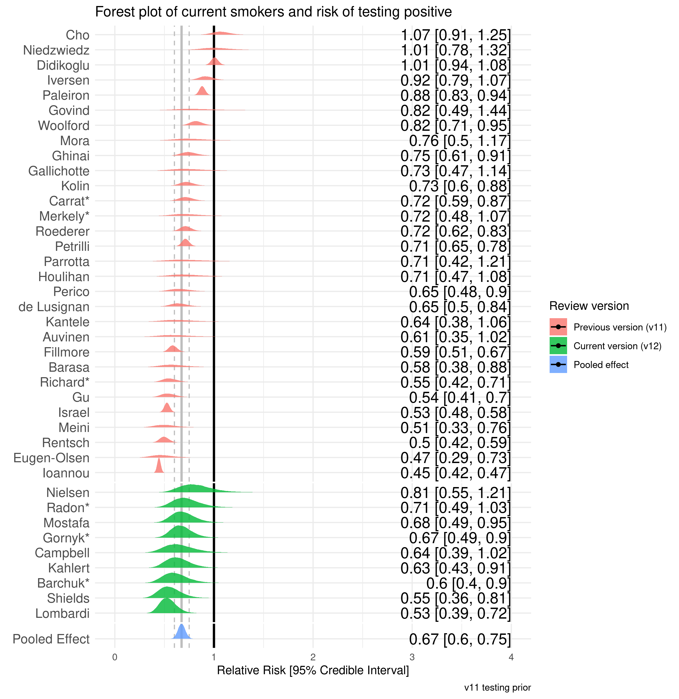


The ECDF shows the probability of the risk being less than or equal to RR = 0.9, `r paste(round(m1_a_ecdf(0.9)*100, 2), "%", sep = "")`

#### Former versus never smokers
```{r former_never}
#former vs. never smokers

former_never_meta <- k %>%
  filter(smoking_status == 'former') %>%
  left_join(., numbers_in_analysis %>%
              rename("study" = lead_author),
            by = c("study")) %>%
  mutate(study = paste(study, contributing_sample, sep = ", n = ")) %>%
  select(-contributing_sample)

a<-metagen(former_never_meta$log_RR,
           former_never_meta$log_SE,
           studlab = former_never_meta$study,
           sm="RR", comb.fixed = F, comb.random = T)

write_rds(a, here("data_clean", "bayes_testing_former.rds"))
```
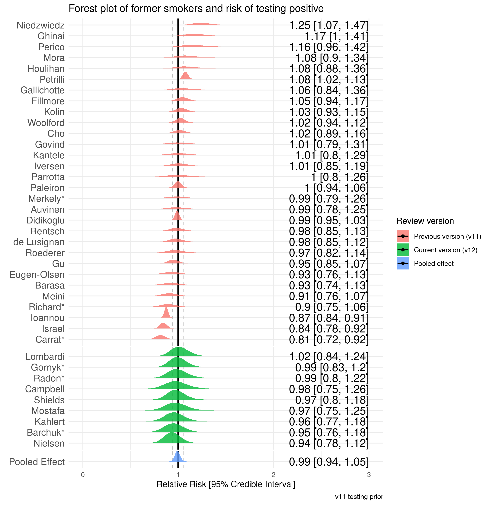
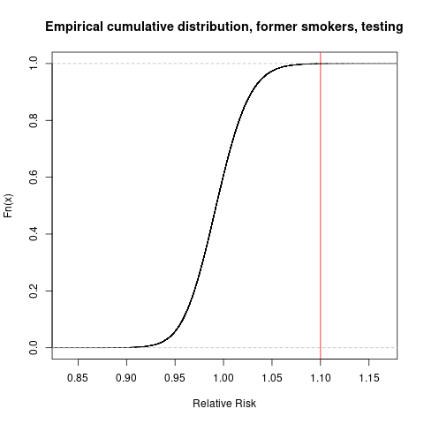

The ECDF shows the probability of the risk being greater than or equal to RR = 1.1, `r paste(round((1-m2_a_ecdf(1.1))*100, 2), "%", sep = "")`

## Table 3: Smoking and COVID-19 hospitalisation
``` {r table_3}

#Table 3
table_3_word <- table_3 %>%
  mutate(., sample = sample_with_outcome) %>%
  mutate(., community_percentage = formatC(number_community/sample*100, digits = 2, format = "f")) %>%
  mutate(., community_current_smoker_percent = formatC(community_current_smoker/number_community*100, digits = 2, format = "f")) %>%
  mutate(., community_former_smoker_percent = formatC(community_former_smoker/number_community*100, digits = 2, format = "f")) %>%
  mutate(., community_current_former_smoker_percent = formatC(community_current_former_smoker/number_community*100, digits = 2, format = "f")) %>%
  mutate(., community_never_smoker_percent = formatC(community_never_smoker/number_community*100, digits = 2, format = "f")) %>%
  mutate(., community_never_unknown_smoker_percent = formatC(community_never_unknown_smoker/number_community*100, digits = 2, format = "f")) %>%
  mutate(., community_not_stated_percent = formatC(community_not_stated/number_community*100, digits = 2, format = "f")) %>%
  mutate(., number_hospitalised_percent = formatC(number_hospitalised/sample*100, digits = 2, format = "f")) %>%
  mutate(., hospitalised_current_smoker_percent = formatC(hospitalised_current_smoker/number_hospitalised*100, digits = 2, format = "f")) %>%
  mutate(., hospitalised_former_smoker_percent = formatC(hospitalised_former_smoker/number_hospitalised*100, digits = 2, format = "f")) %>%
  mutate(., hospitalised_current_former_smoker_percent = formatC(hospitalised_current_former_smoker/number_hospitalised*100, digits = 2, format = "f")) %>%
  mutate(., hospitalised_never_smoker_percent = formatC(hospitalised_never_smoker/number_hospitalised*100, digits = 2, format = "f")) %>%
  mutate(., hospitalised_never_unknown_smoker_percent = formatC(hospitalised_never_unknown_smoker/number_hospitalised*100, digits = 2, format = "f")) %>%
  mutate(., hospitalised_not_stated_percent = formatC(hospitalised_not_stated/number_hospitalised*100, digits = 2, format = "f")) %>%
  select(lead_author, sample_with_outcome, number_community, community_percentage,
         community_current_smoker, community_current_smoker_percent, community_former_smoker, 
         community_former_smoker_percent, community_current_former_smoker,
         community_current_former_smoker_percent, community_never_smoker, community_never_smoker_percent,
         community_never_unknown_smoker, community_never_unknown_smoker_percent, 
         community_not_stated, community_not_stated_percent, number_hospitalised, number_hospitalised_percent,
         hospitalised_current_smoker, hospitalised_current_smoker_percent, hospitalised_former_smoker,
         hospitalised_former_smoker_percent, hospitalised_current_former_smoker, hospitalised_current_former_smoker_percent,
         hospitalised_never_smoker, hospitalised_never_smoker_percent, hospitalised_never_unknown_smoker,
         hospitalised_never_unknown_smoker_percent, hospitalised_not_stated, hospitalised_not_stated_percent) %>%
  write_rds(here::here('data_clean', 'table_3_word.rds'))
```
The number of studies reporting on hospitalisation by smoking status is: `r paste(nrow(table_3_word))`
``` {r}
quality_table_3 <- table_3_word %>%
  left_join(., quality_rating, by = 'lead_author') %>%
  select(lead_author, overall_quality)

a <- table_3_word %>%
  filter(number_community >= 1) %>%
  mutate(Author = lead_author,
         Population = sample_with_outcome,
         Community = paste(
           paste(number_community, 
                 as.integer(community_percentage), sep = " ("), "%)", sep = ""),
         C_current_smoker = paste(paste(community_current_smoker, (community_current_smoker_percent), sep = " (")
                                  , "%)", sep = ""),
         C_current_smoker = na_if(C_current_smoker, "NA ( NA%)"),
         C_former_smoker = paste(paste(community_former_smoker, (community_former_smoker_percent), sep = " (")
                                 , "%)", sep = ""),
         C_former_smoker = na_if(C_former_smoker, "NA ( NA%)"),
         C_current_former_smoker = paste(paste(community_current_former_smoker,
                                               (community_current_former_smoker_percent), sep = " (")
                                         , "%)", sep = ""),
         C_current_former_smoker = na_if(C_current_former_smoker, "NA ( NA%)"),
         C_never_smoker = paste(paste(community_never_smoker,
                                      (community_never_smoker_percent), sep = " (")
                                , "%)", sep = ""),
         C_never_smoker = na_if(C_never_smoker, "NA ( NA%)"),
         C_never_unknown_smoker = paste(paste(community_never_unknown_smoker,
                                              (community_never_unknown_smoker_percent), sep = " (")
                                        , "%)", sep = ""),
         C_never_unknown_smoker = na_if(C_never_unknown_smoker, "NA ( NA%)"),
         C_not_stated = paste(paste(community_not_stated,
                                    (community_not_stated_percent), sep = " (")
                              , "%)", sep = ""),
         C_not_stated = na_if(C_not_stated, "NA ( NA%)")) %>%
  mutate(Hospitalised = paste(
    paste(number_hospitalised, 
          as.integer(number_hospitalised_percent), sep = " ("), "%)", sep = ""),
    H_current_smoker = paste(paste(hospitalised_current_smoker, (hospitalised_current_smoker_percent), sep = " (")
                             , "%)", sep = ""),
    H_current_smoker = na_if(H_current_smoker, "NA ( NA%)"),
    H_former_smoker = paste(paste(hospitalised_former_smoker, (hospitalised_former_smoker_percent), sep = " (")
                            , "%)", sep = ""),
    H_former_smoker = na_if(H_former_smoker, "NA ( NA%)"),
    H_current_former_smoker = paste(paste(hospitalised_current_former_smoker,
                                          (hospitalised_current_former_smoker_percent), sep = " (")
                                    , "%)", sep = ""),
    H_current_former_smoker = na_if(H_current_former_smoker, "NA ( NA%)"),
    H_never_smoker = paste(paste(hospitalised_never_smoker,
                                 (hospitalised_never_smoker_percent), sep = " (")
                           , "%)", sep = ""),
    H_never_smoker = na_if(H_never_smoker, "NA ( NA%)"),
    H_never_unknown_smoker = paste(paste(hospitalised_never_unknown_smoker,
                                         (hospitalised_never_unknown_smoker_percent), sep = " (")
                                   , "%)", sep = ""),
    H_never_unknown_smoker = na_if(H_never_unknown_smoker, "NA ( NA%)"),
    H_not_stated = paste(paste(hospitalised_not_stated,
                               (hospitalised_not_stated_percent), sep = " (")
                         , "%)", sep = ""),
    H_not_stated = na_if(H_not_stated, "NA ( NA%)")) %>%
  select(Author, Population, Community, C_current_smoker, C_former_smoker, C_current_former_smoker,
         C_never_smoker,C_never_unknown_smoker,C_not_stated, Hospitalised, H_current_smoker, H_former_smoker,
         H_current_former_smoker, H_never_smoker, H_never_unknown_smoker, H_not_stated)

         
a$Author <- to_upper_camel_case(a$Author, sep_out = ", ")
a$Author <- plyr::mapvalues(a$Author,
                               from = cleaned_names,
                               to = correct_names)

numeric_columns <- 'Population'

a <- flextable(a) %>%
    set_caption(caption = 'COVID-19 hospitalisation by smoking status') %>%
  colformat_double(j = numeric_columns, digits = 0, na_str = '-', big.mark = ',') %>%
  colformat_char(na_str = '-')

a <- set_header_labels(a,
                       Population = 'Population with outcome',
                       Community = "N (%)",
                       C_current_smoker = "Current smoker (%)",
                       C_former_smoker = "Former smoker (%)",
                       C_current_former_smoker = "Current/former smoker (%)",
                       C_never_smoker = "Never smoker (%)",
                       C_never_unknown_smoker = "Never/unknown smoker (%)",
                       C_not_stated = "Not stated (%)",
                       Hospitalised = "N (%)",
                       H_current_smoker = "Current smoker (%)",
                       H_former_smoker = "Former smoker (%)",
                       H_current_former_smoker = "Current/former smoker (%)",
                       H_never_smoker = "Never smoker (%)",
                       H_never_unknown_smoker = "Never/unknown smoker (%)",
                       H_not_stated = "Not stated (%)") %>%
  add_header_row(top = TRUE, values = c("","Community", "Hospitalised" ), colwidths = c(2, 7, 7)) %>%
  theme_booktabs() %>%
  fix_border_issues() %>%
  set_table_properties(width = 1, layout = 'autofit')
a

saveRDS(a, file = here("reports", "tables", "table_3.rds"))
save_as_docx(a, path = here('output_data', 'Table_3.docx'))
```

### Smoking and hospitalisation meta-analysis {.tabset .tabset-fade .tabset-pills}
```{r current_never hospitalisaiton, echo = F}
table_3 <- table_3_word
included_studies <- quality_table_3 %>%
  filter(overall_quality != 'poor') %>%
  select(lead_author)

fair_quality_3 <- quality_table_3 %>%
  filter(overall_quality != 'fair')
  
```
The studies included in meta-analysis are `r knitr::combine_words(pull(included_studies, lead_author))`.

#### Current versus never smoking for hospitalisation
``` {r}
# Data --------------------------------------------------------------------
meta <- tibble('author' = table_3$lead_author,
               'community_smoker' = table_3$community_current_smoker,
               'community_never_smoker' = table_3$community_never_smoker, 
               'hospitalised_smoker' = table_3$hospitalised_current_smoker, 
               'hospitalised_never_smoker' = table_3$hospitalised_never_smoker,
               'community_former_smoker' = table_3$community_former_smoker,
               'hospitalised_former_smoker' = table_3$hospitalised_former_smoker) %>%
  filter(author %in% included_studies$lead_author)

meta$author <- to_upper_camel_case(meta$author, sep_out = ", ")
meta$author <- plyr::mapvalues(meta$author,
                               from = cleaned_names,
                               to = correct_names)  

# Current smoker hospitalisation ------------------------------------------
event_rates_smoker <- meta %>%
  mutate(., Ee = hospitalised_smoker) %>%
  mutate(., Ne = (hospitalised_smoker+community_smoker)) %>%
  mutate(., Ec = hospitalised_never_smoker) %>%
  mutate(., Nc = (hospitalised_never_smoker+community_never_smoker)) %>%
  rename('Author' = author) %>%
  select(Author, Ee, Ne, Ec, Nc)

event_rates_smoker <- metabin(Ee,
                              Ne,
                              Ec,
                              Nc,
                              data = event_rates_smoker,
                              studlab = paste(Author),
                              comb.fixed = F,
                              comb.random = T,
                              method.tau = 'SJ',
                              hakn = T,
                              prediction = F,
                              incr = 0.1,
                              sm = 'RR')

write_rds(event_rates_smoker, here("data_clean", "bayes_hospital_current.rds"))
```
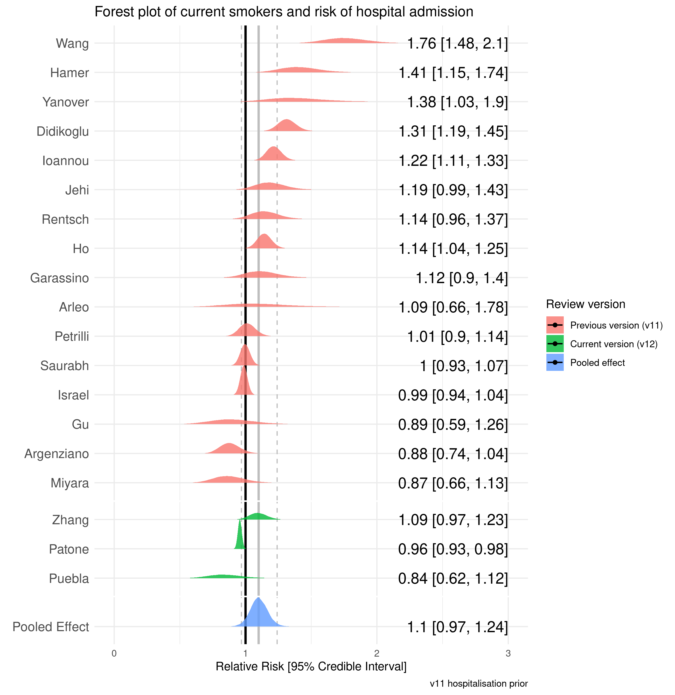

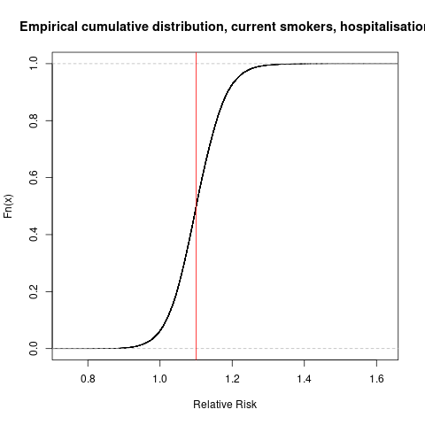

The ECDF shows the probability of the risk being greater than or equal to RR = 1.1, `r paste(round((1-m3_a_ecdf(1.1))*100, 2), "%", sep = "")`

#### Former versus never smoking for hospitalisation
```{r}
# Former smoker hospitalisation -------------------------------------------
event_rates_former <- meta %>%
  mutate(., Ee = hospitalised_former_smoker) %>%
  mutate(., Ne = (hospitalised_former_smoker+community_former_smoker)) %>%
  mutate(., Ec = hospitalised_never_smoker) %>%
  mutate(., Nc = (hospitalised_never_smoker+community_never_smoker)) %>%
  rename('Author' = author) %>%
  select(Author, Ee, Ne, Ec, Nc)

event_rates_former <- metabin(Ee,
                              Ne,
                              Ec,
                              Nc,
                              data = event_rates_former,
                              studlab = paste(Author),
                              comb.fixed = F,
                              comb.random = T,
                              method.tau = 'SJ',
                              hakn = T,
                              prediction = F,
                              incr = 0.1,
                              sm = 'RR')

running_meta_count <- running_meta_count %>%
  full_join(., meta %>%
  rename("study" = author), by = "study") %>%
  select(study)

write_rds(event_rates_former, here("data_clean", "bayes_hospital_former.rds"))
```
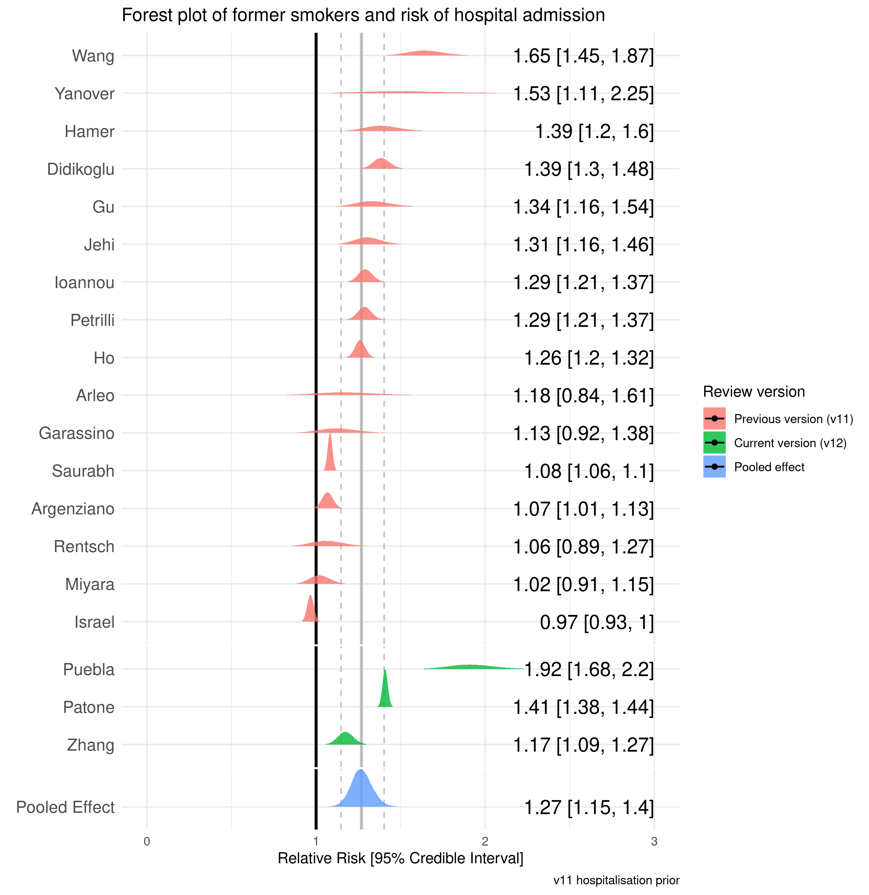


The ECDF shows the probability of the risk being greater than or equal to RR = 1.1, `r paste(round((1-m4_a_ecdf(1.1))*100, 2), "%", sep = "")`

## Table 4: Smoking and COVID-19 disease severity
```{r table_4}
#Table 4
table_4_word <- table_4 %>%
  mutate(., sample = sample_with_severity) %>%
  mutate(., non_severe_disease_percentage = formatC(non_severe_disease/sample*100, digits = 2, format = "f")) %>%
  mutate(., non_severe_current_smoker_percent = formatC(non_severe_current_smoker/non_severe_disease*100, digits = 2, format = "f")) %>%
  mutate(., non_severe_former_smoker_percent = formatC(non_severe_former_smoker/non_severe_disease*100, digits = 2, format = "f")) %>%
  mutate(., non_severe_current_former_smoker_percent = formatC(non_severe_current_former_smoker/non_severe_disease*100, digits = 2, format = "f")) %>%
  mutate(., non_severe_never_smoker_percent = formatC(non_severe_never_smoker/non_severe_disease*100, digits = 2, format = "f")) %>%
  mutate(., non_severe_never_unknown_smoker_percent = formatC(non_severe_never_unknown_smoker/non_severe_disease*100, digits = 2, format = "f")) %>%
  mutate(., non_severe_not_stated_percent = formatC(non_severe_not_stated/non_severe_disease*100, digits = 2, format = "f")) %>%
  mutate(., severe_disease_number_percent = formatC(severe_disease_number/sample*100, digits = 2, format = "f")) %>%
  mutate(., severe_disease_current_smoker_percent = formatC(severe_disease_current_smoker/severe_disease_number*100, digits = 2, format = "f")) %>%
  mutate(., severe_disease_former_smoker_percent = formatC(severe_disease_former_smoker/severe_disease_number*100, digits = 2, format = "f")) %>%
  mutate(., severe_disease_current_former_smoker_percent = formatC(severe_disease_current_former_smoker/severe_disease_number*100, digits = 2, format = "f")) %>%
  mutate(., severe_disease_never_smoker_percent = formatC(severe_disease_never_smoker/severe_disease_number*100, digits = 2, format = "f")) %>%
  mutate(., severe_disease_never_unknown_percent = formatC(severe_disease_never_unknown/severe_disease_number*100, digits = 2, format = "f")) %>%
  mutate(., severe_disease_not_stated_percent = formatC(severe_disease_not_stated/severe_disease_number*100, digits = 2, format = "f")) %>%
  select(lead_author, sample, non_severe_disease, non_severe_disease_percentage, non_severe_current_smoker,
         non_severe_current_smoker_percent, non_severe_former_smoker, non_severe_former_smoker_percent,
         non_severe_current_former_smoker, non_severe_current_former_smoker_percent, non_severe_never_smoker,
         non_severe_never_smoker_percent, non_severe_never_unknown_smoker, non_severe_never_unknown_smoker_percent,
         non_severe_not_stated, non_severe_not_stated_percent, severe_disease_number, severe_disease_number_percent,
         severe_disease_current_smoker, severe_disease_current_smoker_percent, 
         severe_disease_former_smoker, severe_disease_former_smoker_percent, severe_disease_current_former_smoker,
         severe_disease_current_former_smoker_percent, severe_disease_never_smoker, severe_disease_never_smoker_percent,
         severe_disease_never_unknown, severe_disease_never_unknown_percent, severe_disease_not_stated,
         severe_disease_not_stated_percent) %>%
  write_rds(here::here('data_clean', 'table_4_word.rds'))
```
The number of studies reporting on hospitalisation by smoking status is: `r paste(nrow(table_4_word))`
``` {r}
quality_table_4 <- table_4_word %>%
  left_join(., quality_rating, by = 'lead_author') %>%
  select(lead_author, overall_quality)

a <- table_4_word %>%
  mutate(Author = lead_author,
         Population = sample,
         non_severe_disease = paste(
           paste(non_severe_disease, 
                 as.integer(non_severe_disease_percentage), sep = " ("), "%)", sep = ""),
         ns_current_smoker = paste(paste(non_severe_current_smoker, (non_severe_current_smoker_percent), sep = " (")
                                  , "%)", sep = ""),
         ns_current_smoker = na_if(ns_current_smoker, "NA ( NA%)"),
         ns_former_smoker = paste(paste(non_severe_former_smoker, (non_severe_former_smoker_percent), sep = " (")
                                 , "%)", sep = ""),
         ns_former_smoker = na_if(ns_former_smoker, "NA ( NA%)"),
         ns_current_former_smoker = paste(paste(non_severe_current_former_smoker,
                                               (non_severe_current_former_smoker_percent), sep = " (")
                                         , "%)", sep = ""),
         ns_current_former_smoker = na_if(ns_current_former_smoker, "NA ( NA%)"),
         ns_never_smoker = paste(paste(non_severe_never_smoker,
                                      (non_severe_never_smoker_percent), sep = " (")
                                , "%)", sep = ""),
         ns_never_smoker = na_if(ns_never_smoker, "NA ( NA%)"),
         ns_never_unknown_smoker = paste(paste(non_severe_never_unknown_smoker,
                                              (non_severe_never_unknown_smoker_percent), sep = " (")
                                        , "%)", sep = ""),
         ns_never_unknown_smoker = na_if(ns_never_unknown_smoker, "NA ( NA%)"),
         ns_not_stated = paste(paste(non_severe_not_stated,
                                    (non_severe_not_stated_percent), sep = " (")
                              , "%)", sep = ""),
         ns_not_stated = na_if(ns_not_stated, "NA ( NA%)"),
         ) %>%
  mutate(severe_disease = paste(
    paste(severe_disease_number, 
          as.integer(severe_disease_number_percent), sep = " ("), "%)", sep = ""),
    s_current_smoker = paste(paste(severe_disease_current_smoker, (severe_disease_current_smoker_percent), sep = " (")
                             , "%)", sep = ""),
    s_current_smoker = na_if(s_current_smoker, "NA ( NA%)"),
    s_former_smoker = paste(paste(severe_disease_former_smoker, (severe_disease_former_smoker_percent), sep = " (")
                            , "%)", sep = ""),
    s_former_smoker = na_if(s_former_smoker, "NA ( NA%)"),
    s_current_former_smoker = paste(paste(severe_disease_current_former_smoker,
                                          (severe_disease_current_former_smoker_percent), sep = " (")
                                    , "%)", sep = ""),
    s_current_former_smoker = na_if(s_current_former_smoker, "NA ( NA%)"),
    s_never_smoker = paste(paste(severe_disease_never_smoker,
                                 (severe_disease_never_smoker_percent), sep = " (")
                           , "%)", sep = ""),
    s_never_smoker = na_if(s_never_smoker, "NA ( NA%)"),
    s_never_unknown_smoker = paste(paste(severe_disease_never_unknown,
                                         (severe_disease_never_unknown_percent), sep = " (")
                                   , "%)", sep = ""),
    s_never_unknown_smoker = na_if(s_never_unknown_smoker, "NA ( NA%)"),
    s_not_stated = paste(paste(severe_disease_not_stated,
                                 (severe_disease_not_stated_percent), sep = " (")
                           , "%)", sep = ""),
    s_not_stated = na_if(s_not_stated, "NA ( NA%)")) %>%
  select(Author, Population, non_severe_disease, ns_current_smoker, ns_former_smoker,
         ns_current_former_smoker, ns_never_smoker, ns_never_unknown_smoker, ns_not_stated,
         severe_disease, s_current_smoker, s_former_smoker, s_current_former_smoker, s_never_smoker, s_never_unknown_smoker,
         s_not_stated)

         
a$Author <- to_upper_camel_case(a$Author, sep_out = ", ")
a$Author <- plyr::mapvalues(a$Author,
                               from = cleaned_names,
                               to = correct_names)  
numeric_columns <- 'Population'

a <- flextable(a) %>%
    set_caption(caption = 'COVID-19 severity by smoking status') %>%
  colformat_double(j = numeric_columns, digits = 0, na_str = '-', big.mark = ',') %>%
  colformat_char(na_str = '-')

a <- set_header_labels(a,
                       Population = "Population with severity",
                       non_severe_disease = "N (%)",
                       ns_current_smoker = "Current smoker (%)",
                       ns_former_smoker = "Former smoker (%)",
                       ns_current_former_smoker = "Current/former smoker (%)",
                       ns_never_unknown_smoker = "Never/unknown smoker (%)",
                       ns_never_smoker = "Never smoker (%)",
                       ns_not_stated = "Not stated (%)",
                       severe_disease = "N (%)", 
                       s_current_smoker = "Current smoker (%)", 
                       s_former_smoker = "Former smoker (%)", 
                       s_current_former_smoker = "Current/former smoker (%)",
                       s_never_unknown_smoker = "Never/unknown smoker (%)",
                       s_never_smoker = "Never smoker (%)",
                       s_not_stated = "Not stated (%)") %>%
  add_header_row(top = TRUE, values = c("","Non severe disease", "Severe disease" ), colwidths = c(2, 7, 7)) %>%
  theme_booktabs() %>%
  fix_border_issues() %>%
  set_table_properties(width = 1, layout = 'autofit')
a

saveRDS(a, file = here("reports", "tables", "table_4.rds"))
save_as_docx(a, path = here('output_data', 'Table_4.docx'))
```

### Smoking and severity meta-analysis {.tabset .tabset-fade .tabset-pills}
```{r current_never severity, echo = F}
table_4 <- table_4_word
included_studies <- quality_table_4 %>%
  filter(overall_quality != 'poor') %>%
  select(lead_author)

fair_quality_4 <- quality_table_4 %>%
  filter(overall_quality == 'fair')
```
The studies included in meta-analysis are `r knitr::combine_words(pull(included_studies, lead_author))`.

#### Current versus never smoking for risk of severe disease
``` {r}
# Data --------------------------------------------------------------------
meta <- tibble('author' = table_4$lead_author,
               'non_severe_smoker' = table_4$non_severe_current_smoker,
               'non_severe_never_smoker' = table_4$non_severe_never_smoker,
               'severe_smoker' = table_4$severe_disease_current_smoker,
               'severe_never_smoker' = table_4$severe_disease_never_smoker,
               'non_severe_former_smoker' = table_4$non_severe_former_smoker,
               'severe_former_smoker' = table_4$severe_disease_former_smoker) %>%
  filter(author %in% included_studies$lead_author) %>%
  filter(author != "hippisley_cox")

meta$author <- to_upper_camel_case(meta$author, sep_out = ", ")
meta$author <- plyr::mapvalues(meta$author,
                               from = cleaned_names,
                               to = correct_names)  

# Current smoker severity ------------------------------------------
event_rates_smoker <- meta %>%
  mutate(., Ee = severe_smoker) %>%
  mutate(., Ne = (severe_smoker+non_severe_smoker)) %>%
  mutate(., Ec = severe_never_smoker) %>%
  mutate(., Nc = (severe_never_smoker+non_severe_never_smoker)) %>%
  rename('Author' = author) %>%
  select(Author, Ee, Ne, Ec, Nc)

event_rates_smoker <- metabin(Ee,
                              Ne,
                              Ec,
                              Nc,
                              data = event_rates_smoker,
                              studlab = paste(Author),
                              comb.fixed = F,
                              comb.random = T,
                              method.tau = 'SJ',
                              hakn = F,
                              prediction = F,
                              incr = 0.1,
                              sm = 'RR')

running_meta_count <- running_meta_count %>%
  full_join(., meta %>%
  rename("study" = author), by = "study") %>%
  select(study)

write_rds(event_rates_smoker, here("data_clean", "bayes_severity_current.rds"))
```
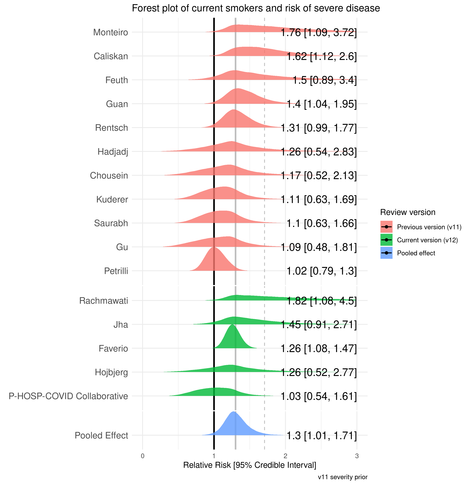


The ECDF shows the probability of the risk being greater than or equal to RR = 1.1, `r paste(round((1-m5_a_ecdf(1.1))*100, 2), "%", sep = "")`

#### Former versus never smoking for risk of severe disease
```{r}
# Former smoker severity -------------------------------------------
event_rates_former <- meta %>%
  mutate(., Ee = severe_former_smoker) %>%
  mutate(., Ne = (severe_former_smoker+non_severe_former_smoker)) %>%
  mutate(., Ec = severe_never_smoker) %>%
  mutate(., Nc = (severe_never_smoker+non_severe_never_smoker)) %>%
  rename('Author' = author) %>%
  select(Author, Ee, Ne, Ec, Nc)

event_rates_former <- metabin(Ee,
                              Ne,
                              Ec,
                              Nc,
                              data = event_rates_former,
                              studlab = paste(Author),
                              comb.fixed = F,
                              comb.random = T,
                              method.tau = 'SJ',
                              hakn = F,
                              prediction = F,
                              incr = 0.1,
                              sm = 'RR')

write_rds(event_rates_former, here("data_clean", "bayes_severity_former.rds"))
```
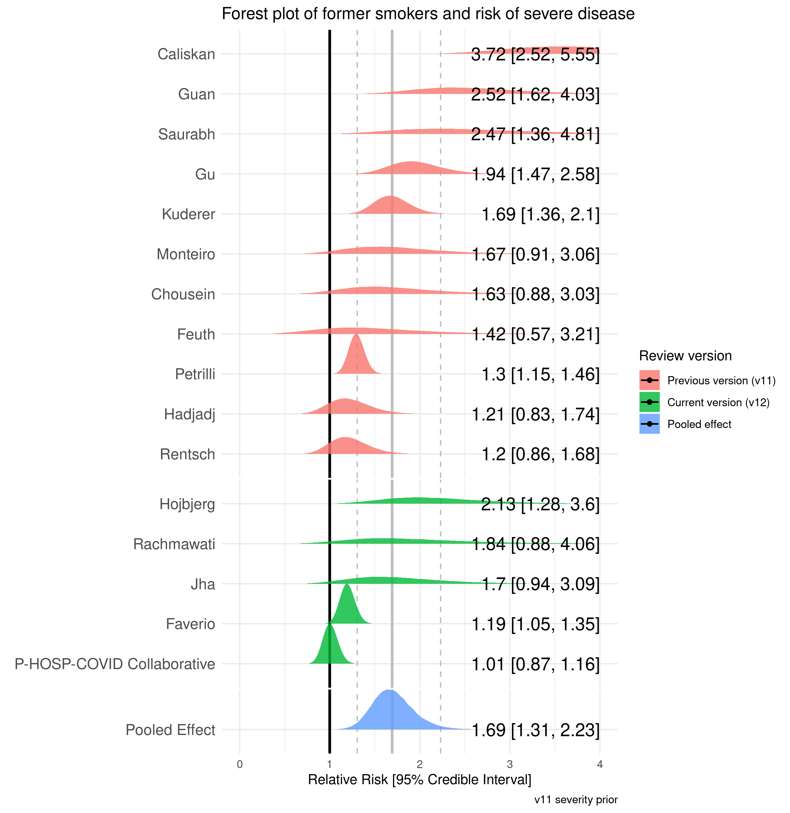


The ECDF shows the probability of the risk being greater than or equal to RR = 1.1, `r paste(round((1-m6_a_ecdf(1.1))*100, 2), "%", sep = "")`

## Table 5: Smoking and COVID-19 mortality
```{r table_5}
#Table 5
table_5_word <- table_5 %>%
  mutate(., sample = sample_with_deaths) %>%
  mutate(., deaths_percentage = formatC(deaths/sample*100, digits = 2, format = "f")) %>%
  mutate(., death_current_smokers_percent = formatC(death_current_smokers/deaths*100, digits = 2, format = "f")) %>%
  mutate(., death_former_smokers_percent = formatC(death_former_smokers/deaths*100, digits = 2, format = "f")) %>%
  mutate(., death_current_former_smokers_percent = formatC(death_current_former_smokers/deaths*100, digits = 2, format = "f")) %>%
  mutate(., death_never_smokers_percent = formatC(death_never_smokers/deaths*100, digits = 2, format = "f")) %>%
  mutate(., death_never_unknown_smokers_percent = formatC(death_never_unknown_smokers/deaths*100, digits = 2, format = "f")) %>%
  mutate(., death_not_stated_percent = formatC(death_not_stated/deaths*100, digits = 2, format = "f")) %>%
  mutate(., recovered_percentage = formatC(recovered/sample*100, digits = 2, format = "f")) %>%
  mutate(., recovered_current_smokers_percent = formatC(recovered_current_smoking/recovered*100, digits = 2, format = "f")) %>%
  mutate(., recovered_former_smokers_percent = formatC(recovered_former_smoker/recovered*100, digits = 2, format = "f")) %>%
  mutate(., recovered_current_former_smokers_percent = formatC(recovered_current_former_smokers/recovered*100, digits = 2, format = "f")) %>%
  mutate(., recovered_never_smokers_percent = formatC(recovered_never_smoker/recovered*100, digits = 2, format = "f")) %>%
  mutate(., recovered_never_unknown_smokers_percent = formatC(recovered_never_unknown_smoker/recovered*100, digits = 2, format = "f")) %>%
  mutate(., recovered_not_stated_percent = formatC(recovered_not_stated/recovered*100, digits = 2, format = "f")) %>%
  select(lead_author, sample, recovered, recovered_percentage, recovered_current_smoking, recovered_current_smokers_percent,
         recovered_former_smoker, recovered_former_smokers_percent, recovered_current_former_smokers,
         recovered_current_former_smokers_percent, recovered_never_smoker, recovered_never_smokers_percent,
         recovered_never_unknown_smoker, recovered_never_unknown_smokers_percent, recovered_not_stated,
         recovered_not_stated_percent,
         deaths, deaths_percentage, death_current_smokers, death_current_smokers_percent,
         death_former_smokers, death_former_smokers_percent, death_current_former_smokers,
         death_current_former_smokers_percent, death_never_smokers, death_never_smokers_percent,
         death_never_unknown_smokers, death_never_unknown_smokers_percent, death_not_stated, death_not_stated_percent) %>%
  write_rds(here::here('data_clean', 'table_5_word.rds'))
```
The number of studies reporting on death by smoking status is: `r paste(nrow(table_5_word))`

``` {r}
quality_table_5 <- table_5_word %>%
  left_join(., quality_rating, by = 'lead_author') %>%
  select(lead_author, overall_quality)

fair_quality_5 <- quality_table_5 %>%
  filter(overall_quality != 'fair')

a <- table_5_word %>%
  mutate(Author = lead_author,
         Population = sample,
         recovered = paste(
           paste(recovered, 
                 as.integer(recovered_percentage), sep = " ("), "%)", sep = ""),
         recovered_current_smoker = paste(paste(recovered_current_smoking, 
                                                 (recovered_current_smokers_percent), sep = " (")
                                  , "%)", sep = ""),
         recovered_current_smoker = na_if(recovered_current_smoker, "NA ( NA%)"),
         recovered_former_smoker = paste(paste(recovered_former_smoker,
                                               (recovered_former_smokers_percent), sep = " (")
                                 , "%)", sep = ""),
         recovered_former_smoker = na_if(recovered_former_smoker, "NA ( NA%)"),
         recovered_current_former_smoker = paste(paste(recovered_current_former_smokers,
                                               (recovered_current_former_smokers_percent), sep = " (")
                                         , "%)", sep = ""),
         recovered_current_former_smoker = na_if(recovered_current_former_smoker, "NA ( NA%)"),
         recovered_never_smoker = paste(paste(recovered_never_smoker,
                                      (recovered_never_smokers_percent), sep = " (")
                                , "%)", sep = ""),
         recovered_never_smoker = na_if(recovered_never_smoker, "NA ( NA%)"),
         recovered_never_unknown_smoker = paste(paste(recovered_never_unknown_smoker,
                                              (recovered_never_unknown_smokers_percent), sep = " (")
                                        , "%)", sep = ""),
         recovered_never_unknown_smoker = na_if(recovered_never_unknown_smoker, "NA ( NA%)"),
         recovered_not_stated = paste(paste(recovered_not_stated,
                                    (recovered_not_stated_percent), sep = " (")
                              , "%)", sep = ""),
         recovered_not_stated = na_if(recovered_not_stated, "NA ( NA%)")) %>%
  mutate(deaths = paste(
           paste(deaths, 
                 as.integer(deaths_percentage), sep = " ("), "%)", sep = ""),
         death_current_smoker = paste(paste(death_current_smokers, 
                                                 (death_current_smokers_percent), sep = " (")
                                  , "%)", sep = ""),
         death_current_smoker = na_if(death_current_smoker, "NA ( NA%)"),
         death_former_smoker = paste(paste(death_former_smokers,
                                               (death_former_smokers_percent), sep = " (")
                                 , "%)", sep = ""),
         death_former_smoker = na_if(death_former_smoker, "NA ( NA%)"),
         death_current_former_smoker = paste(paste(death_current_former_smokers,
                                               (death_current_former_smokers_percent), sep = " (")
                                         , "%)", sep = ""),
         death_current_former_smoker = na_if(death_current_former_smoker, "NA ( NA%)"),
         death_never_smoker = paste(paste(death_never_smokers,
                                      (death_never_smokers_percent), sep = " (")
                                , "%)", sep = ""),
         death_never_smoker = na_if(death_never_smoker, "NA ( NA%)"),
         death_never_unknown_smoker = paste(paste(death_never_unknown_smokers,
                                              (death_never_unknown_smokers_percent), sep = " (")
                                        , "%)", sep = ""),
         death_never_unknown_smoker = na_if(death_never_unknown_smoker, "NA ( NA%)"),
         death_not_stated = paste(paste(death_not_stated,
                                    (death_not_stated_percent), sep = " (")
                              , "%)", sep = ""),
         death_not_stated = na_if(death_not_stated, "NA ( NA%)")) %>%
  select(Author, Population, recovered, recovered_current_smoker, recovered_former_smoker, recovered_current_former_smoker,
         recovered_never_smoker, recovered_never_unknown_smoker, recovered_not_stated, deaths, death_current_smoker,
         death_former_smoker, death_current_former_smoker, death_never_smoker, death_never_unknown_smoker,
         death_not_stated)

         
a$Author <- to_upper_camel_case(a$Author, sep_out = ", ")
a$Author <- plyr::mapvalues(a$Author,
                               from = cleaned_names,
                               to = correct_names)  

numeric_columns <- 'Population'

a <- flextable(a) %>%
    set_caption(caption = 'COVID-19 mortality by smoking status') %>%
  colformat_double(j = numeric_columns, digits = 0, na_str = '-', big.mark = ',') %>%
  colformat_char(na_str = '-')

a <- set_header_labels(a,
                       Population = "Population with mortality",
                       recovered = "N (%)",
                       recovered_current_smoker = "Current smoker (%)",
                       recovered_former_smoker = "Former smoker (%)",
                       recovered_current_former_smoker = "Current/former smoker (%)",
                       recovered_never_unknown_smoker = "Never/unknown smoker (%)",
                       recovered_never_smoker = "Never smoker (%)",
                       recovered_not_stated = "Not stated (%)",
                       deaths = "N (%)", 
                       death_current_smoker = "Current smoker (%)", 
                       death_former_smoker = "Former smoker (%)", 
                       death_current_former_smoker = "Current/former smoker (%)",
                       death_never_unknown_smoker = "Never/unknown smoker (%)",
                       death_never_smoker = "Never smoker (%)",
                       death_not_stated = "Not stated (%)") %>%
  add_header_row(top = TRUE, values = c("","Recovered", "Died" ), colwidths = c(2, 7, 7)) %>%
  theme_booktabs() %>%
  fix_border_issues() %>%
  set_table_properties(width = 1, layout = 'autofit')
a

saveRDS(a, file = here("reports", "tables", "table_5.rds"))
save_as_docx(a, path = here('output_data', 'Table_5.docx'))
```

### Smoking and COVID-19 mortality meta-analysis {.tabset .tabset-fade .tabset-pills}
```{r current_never mortality, echo = F}
exclude <- c("rajter", "garassino", "holman")
table_5 <- table_5_word
included_studies <- quality_table_5 %>%
  filter(overall_quality != 'poor') %>%
  filter(!lead_author %in% exclude) %>%
  select(lead_author)

fair_quality_4 <- quality_table_5 %>%
  filter(overall_quality != 'fair')
```
The studies included in meta-analysis are `r knitr::combine_words(pull(included_studies, lead_author))`.

#### Current versus never smoking for disease mortality
``` {r}
# Data --------------------------------------------------------------------
meta <- tibble('author' = table_5$lead_author,
               'recovered_current_smoker' = table_5$recovered_current_smoking,
               'recovered_never_smoker' = table_5$recovered_never_smoker,
               'death_current_smoker' = table_5$death_current_smokers,
               'death_never_smoker' = table_5$death_never_smokers,
               'recovered_former_smoker' = table_5$recovered_former_smoker,
               'death_former_smoker' = table_5$death_former_smokers) %>%
  filter(author %in% included_studies$lead_author)

meta$author <- to_upper_camel_case(meta$author, sep_out = ", ")
meta$author <- plyr::mapvalues(meta$author,
                               from = cleaned_names,
                               to = correct_names)  


# Current smoker mortality ------------------------------------------
event_rates_smoker <- meta %>%
  mutate(., Ee = death_current_smoker) %>%
  mutate(., Ne = (death_current_smoker+recovered_current_smoker)) %>%
  mutate(., Ec = death_never_smoker) %>%
  mutate(., Nc = (death_never_smoker+recovered_never_smoker)) %>%
  rename('Author' = author) %>%
  select(Author, Ee, Ne, Ec, Nc)

event_rates_smoker <- metabin(Ee,
                              Ne,
                              Ec,
                              Nc,
                              data = event_rates_smoker,
                              studlab = paste(Author),
                              comb.fixed = F,
                              comb.random = T,
                              method.tau = 'SJ',
                              hakn = F,
                              prediction = F,
                              incr = 0.1,
                              sm = 'RR')

write_rds(event_rates_smoker, here("data_clean", "bayes_mortality_current.rds"))
```

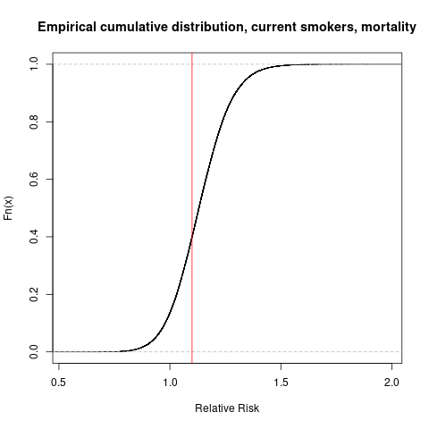

The ECDF shows the probability of the risk being greater than or equal to RR = 1.1, `r paste(round((1-m7_a_ecdf(1.1))*100, 2), "%", sep = "")`

#### Former versus never smoking for disease mortality
```{r}
# Former smoker mortality ------------------------------------------
event_rates_former <- meta %>%
  mutate(., Ee = death_former_smoker) %>%
  mutate(., Ne = (death_former_smoker+recovered_former_smoker)) %>%
  mutate(., Ec = death_never_smoker) %>%
  mutate(., Nc = (death_never_smoker+recovered_never_smoker)) %>%
  rename('Author' = author) %>%
  select(Author, Ee, Ne, Ec, Nc)

event_rates_former <- metabin(Ee,
                              Ne,
                              Ec,
                              Nc,
                              data = event_rates_former,
                              studlab = paste(Author),
                              comb.fixed = F,
                              comb.random = T,
                              method.tau = 'SJ',
                              hakn = F,
                              prediction = F,
                              incr = 0.1,
                              sm = 'RR')

write_rds(event_rates_former, here("data_clean", "bayes_mortality_former.rds"))

running_meta_count <- running_meta_count %>%
  full_join(., meta %>%
  rename("study" = author), by = "study") %>%
  select(study)

```
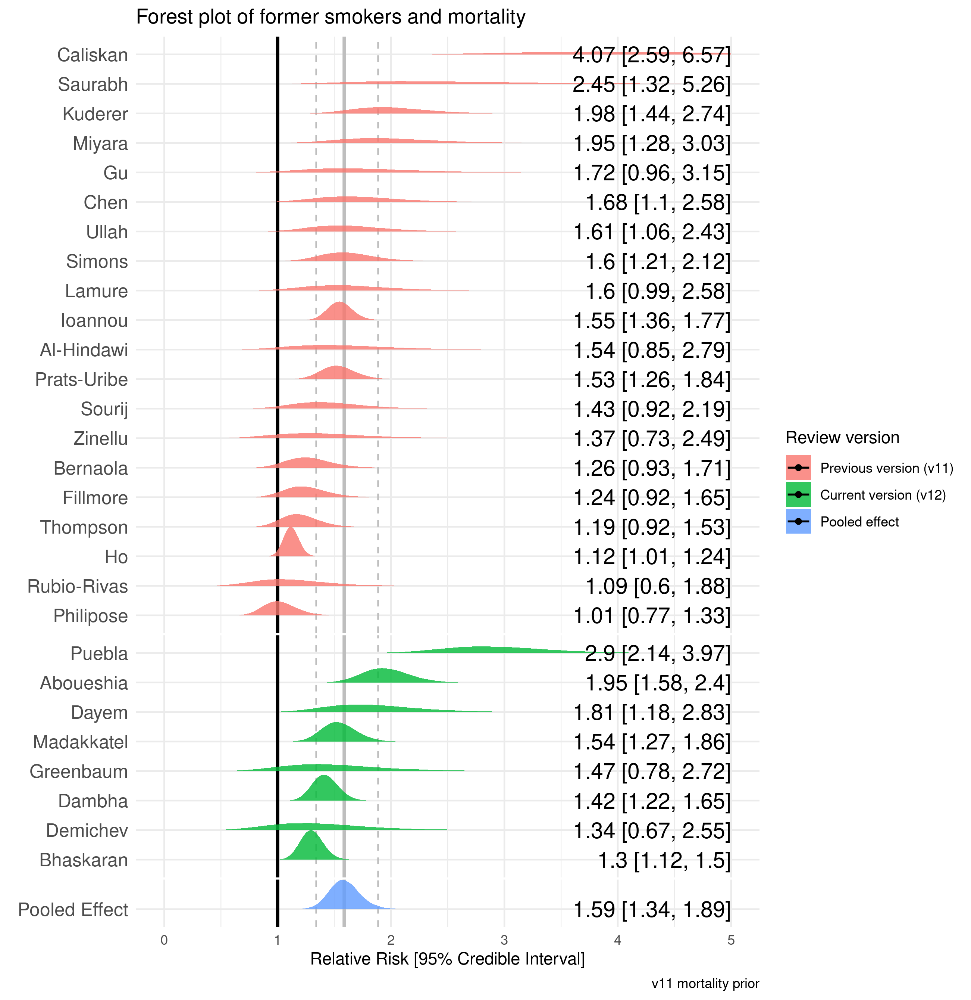
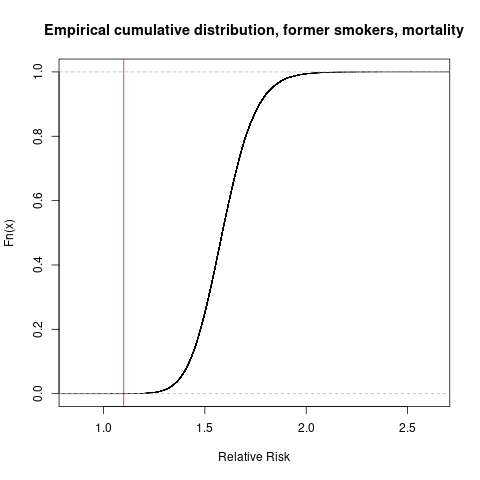

The ECDF shows the probability of the risk being greater than or equal to RR = 1.1, `r paste(round((1-m8_a_ecdf(1.1))*100, 2), "%", sep = "")`

## Study quality assessment
``` {r table_6}
#Table 6
good <- filter(quality_rating, quality_rating$overall_quality == "good" ) %>%
  filter(!lead_author %in% exclude_from_analysis) %>%
  nrow()
fair <- filter(quality_rating, quality_rating$overall_quality == "fair" ) %>%
  filter(!lead_author %in% exclude_from_analysis) %>%
  nrow()
poor <- filter(quality_rating, quality_rating$overall_quality == "poor" ) %>%
  filter(!lead_author %in% exclude_from_analysis) %>%
  nrow()
```
The number of **Good** quality studies are `r paste(good)`, **Fair** quality studies are `r paste(fair)` with `r paste(poor)` **Poor** quality studies

The number of studies included in **Meta-analysis** are `r paste(nrow(running_meta_count))`

# Final PRISMA table
``` {r prisma_final}
prisma <- prisma %>%
  mutate("Studies included in meta-analysis" = nrow(running_meta_count))
flextable(prisma)
```

# Supplementary tables {.tabset .tabset-fade .tabset-pills}

## Supplementary tables

### Data on clinical or virological diagnosis and studies stratifying smoking status
``` {r supplementary_1}
a <- data_study_general %>%
  filter(review_version %in% analysed_versions) %>%
  select(lead_author, study_design, clinical_diagnosis, stratified_smoking) %>%
  filter(!lead_author %in% exclude_from_analysis) %>%
  rename("Lead author" = "lead_author",
         "Study design" = "study_design",
         "Clinical diagnoses included" = "clinical_diagnosis",
         "Stratified smoking reported" = "stratified_smoking") %>%
 mutate("Lead author" = to_upper_camel_case(`Lead author`, sep_out = ", "),
        "Lead author" = plyr::mapvalues(`Lead author`,
                               from = cleaned_names,
                               to = correct_names),
        "Study design" = to_upper_camel_case(`Study design`, sep_out = " "))

a <- a %>%
  flextable() %>%
    set_caption(caption = 'Studies design, inclusion of clinical diagnoses and stratified smoking') %>%
  set_table_properties(width = 1, layout = 'autofit')

save_as_docx(a, path = here('output_data', 'Supplementary_2.docx'))
```

### Country level smoking estimates

``` {r supplementary_country}

country_smoking <-  readxl::read_xlsx(here("data_spreadsheet", "data_extraction_current.xlsx"), sheet = 'national_smoking_prevalence') %>%
  flextable()
save_as_docx(country_smoking, path = here('output_data', 'Supplementary_3.docx'))
```

### Sensitivity
``` {r supplementary_2}


```