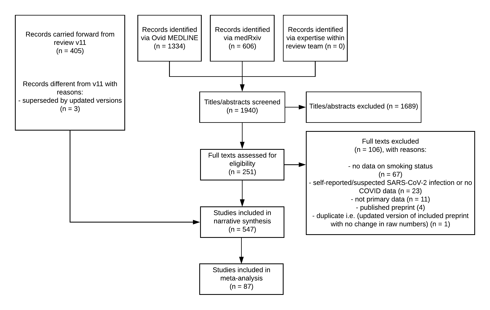

```{r setup, include=FALSE}
knitr::opts_chunk$set(echo = TRUE,
                      warning = F,
                      message = F)
options(width = 180)
unlink('reports/markdown_report_cache', recursive = TRUE)
```

#Abstract

**Aims:** To estimate the association of smoking status with rates of i) infection, ii) hospitalisation, iii) disease severity, and iv) mortality from SARS-CoV-2/COVID-19 disease. 

**Design:** Living rapid review of observational and experimental studies with random-effects hierarchical Bayesian meta-analyses. Published articles and pre-prints were identified via MEDLINE and medRxiv.

**Setting:** Community or hospital. No restrictions on location.

**Participants:** Adults who received a SARS-CoV-2 test or a COVID-19 diagnosis.

**Measurements:** Outcomes were SARS-CoV-2 infection, hospitalisation, disease severity and mortality stratified by smoking status. Study quality was assessed (i.e. ‘good’, ‘fair’ and ‘poor’).

**Findings:** `r paste(current_version)` (searches up to `r paste(tail(search_details$date_screened, 1))`) included `r paste(current_total)` studies with `r paste(running_meta_count)` ‘good’ and ‘fair’ quality studies included in unadjusted meta-analyses. `r paste(nrow(full_smoking_status))` studies (`r paste(round(nrow(full_smoking_status)/current_total*100,1), "%")`) reported current, former and never smoking status with the remainder using broader categories. Recorded smoking prevalence among people with COVID-19 was generally lower than national prevalence. Current compared with never smokers were at reduced risk of SARS-CoV-2 infection (RR = `r paste(round(current_testing_RR_value, 2))`, 95% Credible Interval (CrI) = `r paste(round(current_testing_lci, 2), round(current_testing_uci, 2), sep = "-")`, τ = `r paste(round(current_testing_lci, 2))`). Data for former smokers were inconclusive (RR = `r paste(round(former_testing_RR_value, 2))`, 95% CrI = `r paste(round(former_testing_lci, 2), round(former_testing_uci, 2), sep = "-")`, τ = `r paste(round(former_testing_lci, 2))`) but favoured there being no important association (`r paste(1-m2_a_ecdf(1.1), "%")` probability of RR ≥1.1). Former compared with never smokers were at increased risk of hospitalisation (RR = `r paste(round(former_hospitalisation_RR_value, 2))`, CrI = `r paste(round(former_hospitalisation_lci, 2), round(former_hospitalisation_uci, 2), sep = "-")`, τ = `r paste(round(former_hospitalisation_lci, 2))`), greater disease severity (RR = `r paste(round(former_severity_RR_value, 2))`, CrI = `r paste(round(former_severity_lci, 2), round(former_severity_uci, 2), sep = "-")`, τ = `r paste(round(former_severity_lci, 2))`) and mortality (RR = `r paste(round(former_mortality_RR_value, 2))`, CrI = `r paste(round(former_mortality_lci, 2), round(former_mortality_uci, 2), sep = "-")`, τ = `r paste(round(former_mortality_lci, 2))`). Data for current smokers on hospitalisation, disease severity and mortality were inconclusive (RR = `r paste(round(current_hospitalisation_RR_value, 2))`, 95% CrI = `r paste(round(current_hospitalisation_lci, 2), round(current_hospitalisation_uci, 2), sep = "-")`, τ = `r paste(round(current_hospitalisation_lci, 2))`; RR `r paste(round(current_severity_RR_value, 2))`, 95% CrI = `r paste(round(current_severity_lci, 2), round(current_severity_uci, 2), sep = "-")`, τ = `r paste(round(current_severity_lci, 2))`; RR = `r paste(round(current_mortality_RR_value, 2))`, 95% CrI = `r paste(round(current_mortality_lci, 2), round(current_mortality_uci, 2), sep = "-")`, τ = `r paste(round(current_mortality_lci, 2))`, respectively) but favoured there being no important associations with hospitalisation and mortality (`r paste(1-m3_a_ecdf(1.1), "%")` and `r paste(1-m5_a_ecdf(1.1), "%")` probability of RR ≥1.1, respectively) and a small but important association with disease severity (`r paste(1-m7_a_ecdf(1.1), "%")` probability of RR ≥1.1). 

Conclusions: Compared with never smokers, current smokers appear to be at reduced risk of SARS-CoV-2 infection while former smokers appear to be at increased risk of hospitalisation, greater disease severity and mortality from COVID-19. However, it is uncertain whether these associations are causal.

v7 of this living review article has been published in *Addiction* and is available [here](https://doi-org.libproxy.ucl.ac.uk/10.1111/add.15276)

##Introduction

COVID-19 is a respiratory disease caused by the SARS-CoV-2 virus. Large age and gender differences in case severity and mortality have been observed in the ongoing COVID-19 pandemic[@guan_clinical_2020]; however, these differences are currently unexplained. SARS-CoV-2 enters epithelial cells through the angiotensin-converting enzyme 2 (ACE-2) receptor[@hoffmann_sars-cov-2_2020]. Some evidence suggests that gene expression and subsequent receptor levels are elevated in the airway and oral epithelium of current smokers[@brake_smoking_2020],[@cai_bulk_2020], which could put smokers at higher risk of contracting SARS-CoV-2. Other studies, however, suggest that nicotine downregulates the ACE-2 receptor[@oakes_nicotine_2018]. These uncertainties notwithstanding, both former and current smoking is known to increase the risk of respiratory viral[@denholm_hospitalised_2010],[@abadom_risk_2016] and bacterial[@almirall_proportion_1999],[@feldman_cigarette_2013] infections and is associated with worse outcomes once infected. Cigarette smoke reduces the respiratory immune defence through peri-bronchiolar inflammationand fibrosis, impaired mucociliary clearance and disruption of the respiratory epithelium[@dye_occasional_1994]. There is also reason to believe that behavioural factors (e.g. regular hand-to-mouth movements) involved in smoking may increase SARS-CoV-2 infection and transmission in current smokers. However, early data from the COVID-19 pandemic have not provided clear evidence for a negative impact of current or former smoking on SARS-CoV-2 infection or COVID-19 disease outcomes, such as hospitalisation or mortality[@vardavas_covid-19_2020]. It has also been hypothesised that nicotine might protect against a hyper-inflammatory response to SARS-CoV-2 infection, which may lead to adverse outcomes in patients with COVID-19 disease[@farsalinos_editorial_2020].

There are several reviews that fall within the scope of smoking and COVID-19[@vardavas_covid-19_2020],[@emami_prevalence_2020],[@alqahtani_prevalence_2020],[@patanavanich_smoking_2020],[@berlin_covid-19_0],[@farsalinos_systematic_2020],[@grundy_smoking_2020]. We aimed to produce a rapid synthesis of available evidence pertaining to the rates of infection, hospitalisation, disease severity and mortality from SARS-CoV-2/COVID-19 stratified by smoking status. Given the increasing availability of data on this topic, this is a living review with regular updates. As evidence accumulates, the review will be expanded to include studies reporting COVID-19 outcomes by alternative nicotine use (e.g., nicotine replacement therapy or e-cigarettes).

##Methods

*Study design*

This is a living evidence review  which is updated as new evidence becomes available[@elliott_living_2014]. We adopted recommended best practice for rapid evidence reviews, which involved limiting the search to main databases and having one reviewer extract the data and another verify[@tricco_scoping_2015]. This study was not pre-registered but evolved from a report written for a UK medical society[@simons_smoking_2020]. The most recent (and all future) version(s) of this living review is available [here](https://www.qeios.com/read/latest-UJR2AW). Version 7 of this living review has been published in a peer-reviewed journal[@simons_association_nodate]. A completed Preferred Reporting Items for Systematic Reviews and Meta-Analyses (PRISMA) checklist is included in Supplementary file 1.

*Eligibility criteria*

Studies were included if they:

  1. Were primary research studies using experimental (e.g. randomised controlled trial), quasi-experimental (e.g. pre- and post-test) or observational (e.g. case-control, retrospective cohort, prospective cohort) study designs;
  2. Included adults aged 16+ years;
  3. Recorded as outcome i) results of a SARS-CoV-2 diagnostic test (including antibody assays), ii) clinical diagnosis of COVID-19, iii) hospitalisation with COVID-19, iv) severity of COVID-19 disease in those hospitalised or v) mortality from COVID-19;
Reported any of the outcomes of interest by self-reported or biochemically verified smoking status (e.g. current smoker, former smoker, never smoker) or current vaping and nicotine replacement therapy (NRT) use;
  4. Were available in English;
  5. Were published in a peer-reviewed journal, as a pre-print or a public health report by reputable bodies (e.g. governments, scientific societies).

*Search strategy*

The following terms were searched for in Ovid MEDLINE (2019-search date) as free text or Medical Subject Headings:

  1. Tobacco Smoking/ or Smoking Cessation/ or Water Pipe Smoking/ or Smoking/ or Smoking Pipes/ or Cigar Smoking/ or Smoking Prevention/ or Cigarette Smoking/ or smoking.mp. or Pipe Smoking/ or Smoking, Non-Tobacco Products/ or Smoking Water Pipes/
  2. Nicotine/ or nicotine.mp. or Electronic Nicotine Delivery Systems/ or Nicotine Chewing Gum/
  3. vaping.mp. or Vaping/
  4. 1 or 2 or 3
  5. Coronavirus/ or Severe Acute Respiratory Syndrome/ or Coronavirus Infections/ or covid.mp.
  6. 4 and 5
  
The following terms were searched for in titles, abstracts and full texts in medRxiv (no time limitations):

  1. covid (this term captures both covid and SARS-CoV-2) AND smoking
  2. covid AND nicotine
  3. covid AND vaping
  
Additional articles/reports of interest were identified through mailing lists, Twitter, the International Severe Acute Respiratory and Emerging Infection Consortium (ISARIC) and the US Centers for Disease Control and Prevention (CDC). Where updated versions of pre-prints or public health reports were available, old versions were superseded.

*Selection of studies*

One reviewer screened titles, abstracts and full texts against the inclusion criteria.

*Data extraction*

Data were extracted by one reviewer and verified (i.e. independently checked against pre-prints and published reports) by another on i) author (year); ii) date published; iii) country; iv) study design; v) study setting; vi) sample size; vii) sex; viii) age; ix) smoking status (e.g. current, former, never, not stated, missing) and whether it was biochemically verified; x) use of alternative nicotine products; xi) SARS-CoV-2 testing; xii) SARS-CoV-2 infection; xiii) diagnosis of COVID-19; xiv) hospitalisation with COVID-19; xv) disease severity in those hospitalised with COVID-19; xvi) mortality; xvii) adjustment of smoking specific risk estimates for relevant covariates (e.g. age, sex); and xviii) whether a representative or random sampling method was used.

*Quality appraisal*

The quality of included studies was assessed to determine suitability for inclusion in meta-analyses. Studies were judged as ‘good’ quality if they: i) had <20% missing data on smoking status and used a reliable self-report measure that distinguished between current, former and never smoking status; AND ii) used biochemical verification of smoking status and reported results from adjusted analyses; OR reported data from a representative/random sample. Studies were rated as ‘fair’ if they fulfilled only criterion i) and were otherwise rated as ‘poor’. The quality appraisal was conducted by one reviewer and verified by a second. 

*Evidence synthesis*

A narrative synthesis was conducted. Data from ‘good’ and ‘fair’ quality studies were pooled in R v.3.6.3[@team_r_2013]. In a living review where new data are regularly added to the analyses, it may be more appropriate to use a Bayesian(as opposed to frequentist) approach where prior knowledge is used in combination with new data to estimate a posterior risk distribution. A Bayesian approach mitigates the issue of performing multiple statistical tests, which can inflate family-wise error. A series of random-effects hierarchical Bayesian meta-analyses were performed with the brms[@burkner_advanced_2017] package to estimate the relative risk for each comparison with accompanying 95% credible intervals (CrIs). We first defined prior distributions for the true pooled effect size (µ) and the between-study heterogeneity (τ), with µ specified as a normal distribution with a mean equal to the derived point estimate from each comparison of interest in the immediately preceding version of this living review, and τ specified as a half-Cauchy distribution with a mean of 0 and standard deviation of 1. The half-Cauchy distribution was selected to reflect prior knowledge that high levels of between-study heterogeneity are more likely than lower levels. Markov Chain Monte Carlo methods (20,000 burn-ins followed by 80,000 iterations) were then used to generate a risk distribution for each study, in addition to a pooled effect for the posterior risk distribution. We report forest plots with the pooled effect for the posterior risk distribution displayed as the median relative risk with an accompanying 95% CrIs. We used the empirical cumulative distribution function (ECDF) to estimate the probability of there being a 10% reduction or 10% increase in relative risk (RR) (i.e. RR ≥1.1 or RR ≤0.9). Due to a lack of indication as to what constitutes a clinically or epidemiologically meaningful effect (e.g. with regards to onward disease transmission or requirements for intensive care beds), we deemed a 10% change in risk as small but important. Where data were inconclusive (as indicated by CrIs crossing RR = 1.0), to disambiguate whether data favoured no effect or there being a small but important association, we estimated whether there was ≥75% probability of RR ≥1.1 or RR ≤0.9.

Two sensitivity analyses were performed. First, a minimally informative prior for µ was specified as a normal distribution with a mean of 0 and standard deviation of 1 and τ as described above. Second, an informative prior as described above for µ was used with τ specified as a half-Cauchy distribution with a mean of 0.3 and standard deviation of 1 to reflect greater between-study heterogeneity.

To aid in the visualisation of smoking prevalence in the included studies, the weighted mean prevalence of current and former smoking was calculated for countries with ≥3 studies and plotted for comparison with national prevalence estimates. It should be noted that prevalence estimates in the included studies were not adjusted for age, sex, socioeconomic position, or geographic region within countries.

##Results

In the current review version (`r paste(current_version)`) with searches up to `r paste(tail(search_details$date_screened, 1))`, a total of `r paste(prisma$"Titles/abstracts screened")` records were identified, with `r paste(prisma$"Studies in narrative synthesis")` studies included in a narrative synthesis and `r paste(running_meta_count)` studies included in meta-analyses (see [Figure 1](#fig-1)).

{#fig-1}

*Study characteristics*

Characteristics of included studies are presented in [Table 1](#table-1). Studies were conducted across `r paste(all_countries$Country-1)` countries. `r paste(all_countries[[1]][1,2])` studies were conducted in the `r paste(all_countries[[1]][1,1])`, `r paste(all_countries[[2]][1,2])` in `r paste(all_countries[[2]][1,1])`, `r paste(all_countries[[3]][1,2])` in the `r paste(all_countries[[3]][1,1])`, `r paste(all_countries[[4]][1,2])`  in `r paste(all_countries[[4]][1,1])`, `r paste(all_countries[[5]][1,2])`  in `r paste(all_countries[[5]][1,1]))`, `r paste(all_countries[[6]][1,2]))` in `r paste(all_countries[[6]][1,1])`, `r paste(all_countries[[7]][1,2])` in `r paste(all_countries[[7]][1,1])`, `r paste(all_countries[[8]][1,2])` in `r paste(all_countries[[8]][1,1])`, `r paste(all_countries[[9]][1,2])` in `r paste(unlist(all_countries[[9]][1]), sep = " and ")`, `r paste(all_countries[[10]][1,2])` in `r paste(unlist(all_countries[[10]][1]), sep = " and ")`, `r paste(all_countries[[11]][1,2])` in `r paste(unlist(all_countries[[11]][1]), sep = " and ")`, `r paste(all_countries[[12]][1,2])` in `r paste(unlist(all_countries[[12]][1]), sep = " and ")`, with `r paste(all_countries[[13]][1,2])` each from a further `r paste(nrow(all_countries[[13]][1]))`. The majority of studies used observational designs (see [Supplementary table S1](#supplementary-t1)). `r paste(setting[1,2])` (`r paste(round(setting[1,2]/sum(setting[2])*100, 1))`%) were conducted in `r paste(tolower(setting[1,1]))` settings, `r paste(setting[2,2])` studies (`r paste(round(setting[2,2]/sum(setting[2])*100, 1))`%) included individuals from `r paste(tolower(setting[2,1]))` settings, `r paste(setting[3,2])` studies (`r paste(round(setting[3,2]/sum(setting[2])*100, 1))`%) were conducted exclusively in the `r paste(tolower(setting[3,1]))`, with one study each conducted in a homeless shelter and a quarantine centre, and one study that did not state the study setting. Studies had a median of `r paste(participants[3])` (interquartile range = `r paste(participants[2], participants[5], sep = "-")`) participants. The majority of studies (`r paste(round(sum(diagnostics[5]+diagnostics[6])/sum(diagnostics)*100,1))`%) used reverse transcriptase polymerase chain reaction (RT-PCR) for confirmation of SARS-CoV-2 infection, `r paste(round(sum(diagnostics[1]+diagnostics[6])/sum(diagnostics)*100,1))`% used an antibody test to confirm prior infection and `r paste(round(diagnostics[6]/sum(diagnostics)*100,1))` of studies relied on a combination of RT-PCR or antibody assays.

*Smoking status*

Categorisation of smoking status was heterogeneous (see [Table 1](#table-1)). `r paste(data_source[1,2])` studies collected data on smoking status through routine electronic health records (EHRs), `r paste(data_source[2,2])` studies used a bespoke case report form for COVID-19 and `r paste(data_source[3,2])` studies did not state the source for information on smoking status. None of the studies verified smoking status biochemically. Notably, only `r paste(nrow(full_smoking_status))` (`r paste(round(nrow(full_smoking_status)/current_total*100,1))`%) studies reported current, former and never smoking status (see [Supplementary table S2a](#supplementary-t2a)), with a further 26 studies reporting only ever and never smoking status (see [Supplementary table S2b](#supplementary-t2b)). The remaining `r paste(nrow(incomplete_smoking_status))` studies reported current, current/former or current and former smoking status but did not explicitly state whether remaining participants were never smokers or if data were missing on smoking status (see [Supplementary table S2c](#supplementary-t2c). `r paste(nrow(missing_smok))` studies explicitly reported the proportion with missing data on smoking status, which ranged from `r paste(round(minimum,2), "%", sep = "")` to `r paste(round(maximum,2), "%", sep = "")`. 

*Use of alternative nicotine products*

Six studies recorded the use of alternative nicotine products in current and/or former smokers but did not report COVID-19 outcomes stratified by alternative nicotine use[@miyara_low_2020],[@rimland_clinical_2020],[@girardeau_confirmed_nodate],[@ebinger_sars-cov-2_2020],[@islam_risk_2020],[@gallichotte_longitudinal_2020].

*Quality appraisal*

Two studies were performed in random, representative population samples and were rated as ‘good’ quality, and `r paste(nrow(fair_quality_number))` studies were rated as ‘fair’ quality, of which `r paste(running_meta_count)` studies reported results stratified by smoking status for the outcomes of interest and could be included in meta-analyses. The remaining `r paste(nrow(poor_quality_number))` studies were rated as ‘poor’ quality (see [Table 1](#table-1)).

*Table 1.*{#table-1}
``` {r table_1}
library(flextable)

readRDS(file = here::here("reports", "tables", "table_1.rds")) %>%
  flextable() %>%
  colformat_md() %>%
  autofit()
```

*Smoking prevalence by country*

Unadjusted smoking prevalence compared with overall estimates for national adult smoking prevalence split by country and study setting is presented in [Figure 2a](#fig-2a) and [2b](#fig-2b). Lower than expected current smoking prevalence was generally observed, especially in studies with hospitalised samples. Former smoking prevalence was more similar to expected prevalence when reported; however, prevalence was typically higher than national estimates. National smoking prevalence estimates used for comparison are presented in [Supplementary table 3](#supplementary-t3).

{#fig-2a}

{#fig-2b}

*SARS-CoV-2 testing by smoking status*

Three studies provided data on access to SARS-CoV-2 diagnostic testing for those meeting local testing criteria by smoking status. In a cohort study of US military veterans aged 54-75[@rentsch_covid-19_2020], current smokers were more likely to receive a test: 42.3% (1,603/3,789) of the sample were current smokers compared with 23.8% of all veterans aged 50+ years using any tobacco product between 2010-201533. In the UK Biobank cohort[@niedzwiedz_ethnic_2020], a multivariable analysis showed former (RR = 1.29, 95% CI = 1.14-1.45, p < .001) and current (RR = 1.44, 95% CI = 1.20-1.71, p < .001) compared with never smokers to be more likely to receive a test. In an Australian rapid assessment screening clinic for COVID-19[@trubiano_covid-match65_2020], 9.4% (397/4,226) of the self-referred sample (subsequently assessed by a healthcare professional to decide on testing) were current smokers. Of these self-referrals, healthcare professionals decided that current compared with former or never smokers were less likely to require a test (RR = 0.93, 95% CI = 0.86-1.0, p = 0.045).

*SARS-CoV-2 infection by smoking status*

`r paste(nrow(table_2_word))` studies provided data on SARS-CoV-2 infection for people meeting local testing criteria by smoking status (see [Table 2](#table-2)). Meta-analyses were performed for `r paste(nrow(good_quality_2))` ‘good’ and `r paste(nrow(fair_quality_2))` ‘fair’ quality studies (see [Figure 3](#fig-3) and [4](#fig-4)). Current smokers were at reduced risk of testing positive for SARS-CoV-2 compared with never smokers (RR = `r paste(round(current_testing_RR_value, 2))`, 95% Credible Interval (CrI) = `r paste(round(current_testing_lci, 2), round(current_testing_uci, 2), sep = "-")`, τ = `r paste(round(current_testing_lci, 2))`). The probability of current smokers being at reduced risk of infection compared with never smokers (RR ≤0.9) was `r paste(round(m1_a_ecdf(0.9),1))`%. Former compared with never smokers were at increased risk of testing positive, but data were inconclusive (RR = `r paste(round(former_testing_RR_value, 2))`, 95% CrI = `r paste(round(former_testing_lci, 2), round(former_testing_uci, 2), sep = "-")`, τ = `r paste(round(former_testing_lci, 2))`) and favoured there being no important association. The probability of former smokers being at increased risk of infection (RR ≥1.1) compared with never smokers was (`r paste(1-m2_a_ecdf(1.1), "%")` probability of RR ≥1.1). Results were materially unchanged in sensitivity analyses.

*Table 2*{#table-2}
``` {r table_2}
readRDS(file = here::here("reports", "tables", "table_2.rds"))
```

{#fig-3}
 
{#fig-4}

*Hospitalisation for COVID-19 by smoking status*

`r paste(nrow(table_3_word))` studies examined hospitalisation for COVID-19 disease, stratified by smoking status (see [Table 3](#table-3)). Meta-analyses were performed for `r paste(nrow(fair_quality_3))` ‘fair’ quality studies (see [Figure 5](#fig-5) and [6](#fig-6)). Current (RR = `r paste(round(current_hospitalisation_RR_value, 2))`, 95% CrI = `r paste(round(current_hospitalisation_lci, 2), round(current_hospitalisation_uci, 2), sep = "-")`, τ = `r paste(round(current_hospitalisation_lci, 2))`) and former (RR = `r paste(round(former_hospitalisation_RR_value, 2))`, CrI = `r paste(round(former_hospitalisation_lci, 2), round(former_hospitalisation_uci, 2), sep = "-")`, τ = `r paste(round(former_hospitalisation_lci, 2))`) compared with never smokers were at increased risk of hospitalisation with COVID-19. However, data for current smokers were inconclusive and favoured there being no important association. The probability of current and former smokers being at increased risk of hospitalisation (RR ≥1.1) compared with never smokers was `r paste(1-m3_a_ecdf(1.1), "%")` and `r paste(1-m4_a_ecdf(1.1), "%")`, respectively. Results were materially unchanged in two sensitivity analyses. 

*Table 3*{#table-3}
``` {r table_3}
readRDS(file = here::here("reports", "tables", "table_3.rds"))
```

{#fig-5}
 
{#fig-5}

*Disease severity by smoking status*

`r paste(nrow(table_4_word))` studies reported disease severity in hospitalised patients stratified by smoking status (see [Table 4](#table-4)). Severe (as opposed to non-severe) disease was broadly defined as requiring intensive treatment unit (ITU) admission, requiring oxygen as a hospital inpatient or in-hospital death. Meta-analyses were performed for `r paste(nrow(fair_quality_4))` ‘fair’ quality studies (see [Figure 7](#fig-7) and [8](#fig-8)). Current (RR = `r paste(round(current_severity_RR_value, 2))`, 95% CrI = `r paste(round(current_severity_lci, 2), round(current_severity_uci, 2), sep = "-")`, τ = `r paste(round(current_severity_lci, 2))`) and former (RR = `r paste(round(former_severity_RR_value, 2))`, 95% CrI = `r paste(round(former_severity_lci, 2), round(former_severity_uci, 2), sep = "-")`, τ = `r paste(round(former_severity_lci, 2))`) compared with never smokers were at increased risk of greater disease severity; data for current smokers were inconclusive but favoured there being a small but important association. The probability of current and former smokers having increased risk of greater disease severity (RR ≥1.1) compared with never smokers was `r paste(1-m5_a_ecdf(1.1), "%")` and `r paste(1-m6_a_ecdf(1.1), "%")`, respectively. Results were materially unchanged in two sensitivity analyses. 

*Table 4*{#table-4}
``` {r table_4}
readRDS(file = here::here("reports", "tables", "table_4.rds"))
```

{#fig-7}
 
{#fig-8}

*Mortality by smoking status*

`r paste(nrow(table_5_word))` studies reported mortality from COVID-19 by smoking status (see [Table 5](#table-5)), with `r paste(nrow(fair_quality_5))` ‘fair’ quality studies included in meta-analyses (see [Figure 9](#fig-9) and [10](#fig-10)). Current (RR = `r paste(round(current_mortality_RR_value, 2))`, 95% CrI = `r paste(round(current_mortality_lci, 2), round(current_mortality_uci, 2), sep = "-")`, τ = `r paste(round(current_mortality_lci, 2))`) and former (RR = `r paste(round(former_mortality_RR_value, 2))`, 95% CrI = `r paste(round(former_mortality_lci, 2), round(former_mortality_uci, 2), sep = "-")`, τ = `r paste(round(former_mortality_lci, 2))`) compared with never smokers were at increased risk of in-hospital mortality from COVID-19. However, data for current smokers were inconclusive and favoured there being no important association. The probability of current and former smokers being at greater risk of in-hospital mortality (RR ≥1.1) compared with never smokers was `r paste(1-m7_a_ecdf(1.1), "%")` and `r paste(1-m8_a_ecdf(1.1), "%")`, respectively. Results were materially unchanged in two sensitivity analyses. 

*Table 5*{#table-5}
``` {r table_5}
readRDS(file = here::here("reports", "tables", "table_5.rds"))
```

{#fig-9}
 
{#fig-10}

*Discussion*

This living rapid review found uncertainty in the majority of `r paste(current_total)` studies arising from the recording of smoking status. Notwithstanding these uncertainties, compared with overall adult national prevalence estimates, recorded current smoking rates in most studies were lower than expected. In a subset of better-quality studies (n = `r paste()`), current but not former smokers had a reduced risk of testing positive for SARS-CoV-2 but current smokers appeared somewhat more likely to present for testing and/or receive a test. Data for current smokers on the risk of hospitalisation, disease severity and mortality were inconclusive, and favoured there being no important associations with hospitalisation and mortality and a small but important increase in the risk of severe disease. Former smokers were at increased risk of hospitalisation, disease severity and mortality compared with never smokers.
Issues complicating interpretation

Interpretation of results from studies conducted during the first phase of the SARS-CoV-2 pandemic is complicated by several factors (see Figure 11):

1) Exposure to SARS-CoV-2

i.	Exposure to the SARS-CoV-2 virus is heterogeneous with different subgroups at heightened risk of infection at different stages of the pandemic, at least partly due to differential contact matrices by age, sex and socioeconomic position36, which are associated with smoking status.
ii.	The probability of viral exposure depends largely on local prevalence, which varies over time. This likely introduces bias in studies assessing the rate of infection by smoking status conducted in the early phase of the pandemic.

2) Infection with SARS-CoV-2

i.	Infection following viral exposure depends on individual differences in, for example, genetic susceptibility or immunocompetence, which are poorly understood at present. For example, the household secondary attack rate for COVID-19 is estimated at 17%37.  
ii.	Heated and humidified air may act to disrupt the ability of the virus to persist in the airway mucosa of smokers. There is some evidence that transient localised hyperthermia can inhibit replication of rhinoviruses, a non-enveloped virus that causes the common cold38. However, as SARS-CoV-2 is an enveloped virus39, it is unclear whether a similar protective effect against viral replication or invasion by heated and humidified air may occur.

3) Symptomatic COVID-19

i.	An estimated 20% (95% CI = 17-25%) of COVID-19 cases are asymptomatic40, with some evidence suggesting younger people are more likely to be asymptomatic41. Testing is hence likely limited in some subgroups, with the potential for these groups to include an overrepresentation of current smokers.
ii.	Current and former smokers may be more likely to meet local criteria for community testing due to increased prevalence of symptoms consistent with SARS-CoV-2 infection, such as cough, increased sputum production or altered sense of smell or taste42. Evidence from a small number of studies indicates that current smokers may be more likely to present for testing, hence increasing the denominator in comparisons with never smokers and potentially inflating the rate of negative tests in current smokers. Infection positivity rates estimated among random samples are more informative. We identified one population study conducted in Hungary reporting on seroprevalence and smoking status43; however, the response rate was only 58.8% and the current smoking rate was 10 percentage points below national prevalence estimates, which raises some doubt about representativeness of the final sample. Similarly, a second representative population survey with results from three regions in France44 reported a current smoking rate of more than 10 percentage points below national prevalence (12% vs. 25% daily smoking prevalence)45.

4) Testing positive for SARS-CoV-2

i.	Smokers with COVID-19 may be less likely to receive a SARS-CoV-2 test or present to hospital due to lack of access to healthcare and may be more likely to die in the community from sudden complications (i.e. self-selection bias) and thus not be recorded46. 
ii.	Diagnostic criteria for SARS-CoV-2 infection and COVID-19 have changed during the course of the pandemic47. It was not possible to extract details on the specific RT-PCR or antibody-based techniques or platforms used across the included studies due to reporting gaps. Different platforms have varying sensitivity and specificity to detect SARS-CoV-2 infection. In addition, testing for acute infection requires swabbing of the mucosal epithelium, which may be disrupted in current smokers, potentially altering the sensitivity of assays48. 

5) Hospitalisation with COVID-19

i.	Reasons for hospitalisation vary by country and time in the pandemic. For example, early cases may have been hospitalised for isolation and quarantine reasons and not due to medical necessity. It is plausible this may have skewed early data towards less severe cases. In addition, the observed association between former smoking and greater disease severity may be explained by collider bias49, where conditioning on a collider (e.g. testing or hospitalisation) by design or analysis may introduce a spurious association between current or former smoking (a potential cause of testing or hospitalisation) and SARS-CoV-2 infection/adverse outcomes from COVID-19 (potentially exacerbated by smoking)50.  
ii.	The majority of included studies relied on EHRs as the source of information on smoking status. Research shows large discrepancies between EHRs and actual behaviour51. Known failings of EHRs include implausible longitudinal changes, such as former smokers being recorded as never smokers at subsequent hospital visits51. Misreporting on the part of the patient (perhaps due to perceived stigma) has also been observed, with biochemical measures showing higher rates of smoking compared with self-report in hospitalised patients in the US52. It is hence possible that under-reporting of current and former smoking status in hospitals occurred across the included studies. 
iii.	The majority of included studies were conducted in hospital settings. It is plausible that a non-trivial proportion of patients were infected with SARS-CoV-2 while being an inpatient for a different medical reason. If so, this may have biased the hospitalised populations towards older and more frail groups, who are less likely to be smokers53.
iv.	Individuals with severe COVID-19 symptoms may have stopped smoking immediately before admission to hospital and may therefore not have been recorded as current smokers (i.e. reverse causality). 

6) COVID-19 disease severity and death

i.	Given lack of knowledge of the disease progression and long-term outcomes of COVID-19, it is unclear whether studies conducted thus far in the pandemic have monitored patients for a sufficient time period to report complete survival outcomes or whether they are subject to early censoring. Adding to this, COVID-19 related mortality has been differentially defined across countries and epidemic phases. For example, in some UK reporting, death within 28 days of a COVID-19 diagnosis is required for attributing the cause of death to the virus. However, according to the UK Office for National Statistics, COVID-19 deaths are recorded only if this was stated on the death certificate. 
ii.	If there is a protective effect of nicotine on COVID-19 disease outcomes, abrupt nicotine withdrawal upon hospitalisation may lead to worse disease outcomes including death12.
iii.	During periods of heightened demand of limited healthcare resources, current and former smokers with extensive comorbidities may have reduced priority for intensive care admission, thus leading to higher in-hospital mortality. 
iv.	COVID-19 outcomes are currently limited to in-hospital death or survival to discharge. This binary outcome does not capture potential long-term morbidity attributed to COVID-19, such as stroke, amputation or acute cardiac events, which may be moderated by smoking status. 
Figure 11. A schematic of some of the interpretation issues for the association of smoking status and COVID-19 infection, hospitalisation, disease severity and mortality. Numbers refer to the issues listed in-text in the above section. Issues presented on the right-hand side relate directly to smoking status.

Limitations

This living rapid evidence review was limited by having a single reviewer extracting data with a second independently verifying the data extracted to minimise errors, restricting the search to one electronic database and one pre-print server and by not including at least three large population surveys due to their reliance on self-reported suspected or confirmed SARS-CoV-2 infection (which means they do not meet our eligibility criteria)42,54,55. We also did not include a large, UK-based, representative seroprevalence study56 in our meta-analyses as the odds of testing positive in former smokers was not reported. However, the odds of infection for current smokers (OR = 0.64, 95% CI = 0.58-0.71) was in concordance with the pooled estimate in our meta-analysis. Population surveys – particularly with linked data on confirmed infection or antibodies – will be included in future review versions to help mitigate some of the limitations of healthcare based observational studies. The comparisons of current and former smoking prevalence in the included studies with national prevalence estimates did not adjust observed prevalence for the demographic profile of those tested/admitted to hospital. Other reviews focused on this comparison have applied adjustments for sex and age, and continue to find lower than expected prevalence – notwithstanding the issues complicating interpretation described above17.

Implications for research, policy and practice

Further scientific research is needed to resolve the mixed findings summarised in our review. First, clinical trials of the posited therapeutic effect of nicotine could have important implications both for smokers and for improved understanding of how the SARS-CoV-2 virus causes disease in humans. Such trials should focus on medicinal nicotine (as smoked tobacco is a dirty delivery mechanism that could mask beneficial effects) and potentially differentiate between different modes of delivery (i.e. inhaled vs. ingested) since this can affect pharmacokinetics57 and potential therapeutic effects. A second research priority would be a large, representative (randomly sampled) population survey with a validated assessment of smoking status which distinguishes between recent and long-term ex-smokers – ideally biochemically verified – and assesses seroprevalence and links to health records.
 
In the meantime, public-facing messages about the possible protective effect of smoking or nicotine are premature. In our view, until there is further research, the quality of the evidence does not justify the huge risk associated with a message likely to reach millions of people that a lethal activity, such as smoking, may protect against COVID-19. It continues to be appropriate to recommend smoking cessation and emphasise the role of alternative nicotine products to support smokers to stop as part of public health efforts during COVID-19. At the very least, smoking cessation reduces acute risks from cardiovascular disease and could reduce demands on the healthcare system58. GPs and other healthcare providers can play a crucial role – brief, high-quality and free online training is available at National Centre for Smoking Cessation and Training.

Conclusion

Across 345 studies, recorded current but not past smoking prevalence was generally lower than national prevalence estimates. Current smokers were at reduced risk of testing positive for SARS-CoV-2 and former smokers were at increased risk of hospitalisation, disease severity and mortality compared with never smokers.

Acknowledgements

An original short review for the Royal College of Physicians was converted to an extended living review after a request by Martin Dockrell, Tobacco Control Lead, Public Health England. All scientific decisions were made by the authors independently of funders and external organisations. The authors would like to thank Rosemary Koper for her assistance in running the electronic searches and data extraction up until v7, and all authors who responded to requests for additional data. 

Declaration of conflicts of interest

DS and OP have no conflicts of interest to declare. LS has received a research grant and honoraria for a talk and travel expenses from manufacturers of smoking cessation medications (Pfizer and Johnson & Johnson). JB has received unrestricted research funding to study smoking cessation from companies who manufacture smoking cessation medications. All authors declare no financial links with tobacco companies or e-cigarette manufacturers or their representatives.

Funding statement

DS is supported by a PhD studentship from the UK Biotechnology and Biological Sciences Research Council [BB/M009513/1]. OP receives salary support from Cancer Research UK (C1417/A22962). JB, LS, & OP are members of SPECTRUM, a UK Prevention Research Partnership Consortium (MR/S037519/1). UKPRP is an initiative funded by the UK Research and Innovation Councils, the Department of Health and Social Care (England) and the UK devolved administrations, and leading health research charities.
Future review versions
https://www.qeios.com/read/latest-UJR2AW

Previous review versions
Version 1: https://doi.org/10.32388/UJR2AW 
Version 2: https://doi.org/10.32388/UJR2AW.3 
Version 3: https://doi.org/10.32388/UJR2AW.4 
Version 4: https://doi.org/10.32388/UJR2AW.5 
Version 5: https://doi.org/10.32388/UJR2AW.6
Version 6: https://doi.org/10.32388/UJR2AW.7
Version 7: https://doi.org/10.1111/add.15276 
Version 8: https://doi.org/10.32388/UJR2AW.9 
Version 9: https://doi.org/10.32388/UJR2AW.10 
 
Data availability
All data contributing to the current and future review versions are available here: https://doi.org/10.6084/m9.figshare.12756020    
All code required to reproduce the current and future analyses are available here:  https://doi.org/10.5281/zenodo.4002046 